# Fase 0 — Construcción de la aplicación SCA2

Estado de la fase 0 del plan de rediseño (cap. 07): creación de la aplicación aislada `SCA2`, migración de la
fuente de datos de sus record types y copia del batch A de reglas e interfaces. Entorno: `mapfrespain-dev`.

## 1. Aplicación SCA2

- **Nombre:** `SCA2 Sistema Comercial de Anulaciones` · prefijo `SCA2` · urlIdentifier `ii9ZQA`
- **UUID:** `_a-0000f069-4f37-8000-9cc8-011c48011c48_20050128`
- **Grupos:** `SCA2 Administrators` (`_e-0000f069-4e92-8000-9c18-01075c01075c_8069`, miembros: devin,
  GGALV10@mapfre.net) y `SCA2 Users` (`_e-0000f069-4e92-8000-9c18-01075c01075c_8071`).
- **Seguridad:** los objetos creados vía MCP heredan la seguridad por defecto de la aplicación
  (Administrators = admin, Users = viewer) al pasar `appUuid` en las llamadas `create*`.
- **Carpetas:** rulesAndConstants, knowledgeCenter, artifacts, documentation y processModels creadas por Appian
  (UUIDs registrados en `sca2_uuids.json`).

## 2. Data source "SCA2 DataBase AWS"

- **UUID connected system:** `_a-0000f069-4f37-8000-9cc8-011c48011c48_20050863`
- **Schema PostgreSQL:** `sca2_anulaciones`
- **Data source anterior (origen):** `SCAC AWS DB` (`_a-0000eb9b-717e-8000-9c54-011c48011c48_12081503`), schema compartido de SCA.

### Limitación del MCP y procedimiento

`updateRecordType` del MCP `appian-dev-mcp-desarrollo-05c9` **no admite `dataSourceUuid`** (limitación verificada).
La migración se hizo manualmente en **Designer**: record type → *Change source / Cambiar tabla de base de datos* →
seleccionar el data source y la tabla `sca2_*` ya creada → mapear columnas por nombre → sincronizar.
Los **UUIDs de los record types se conservan** (verificado releyendo los 15 objetos tras el cambio — ningún uuid
cambió, nº de campos intacto).

### Estado por record type

| Record type | UUID | Tabla | Data source | Estado |
|---|---|---|---|---|
| SCA2 Solicitud | `c531595c-…` | `sca2_solicitud` | SCA2 DataBase AWS | ✅ migrado (36 campos, 15 rel.) |
| SCA2 Transicion | `0b46024c-…` | `sca2_transicion` | SCA2 DataBase AWS | ✅ migrado (12 campos, 2 rel.) |
| SCA2 Tarea | `696285d3-…` | `sca2_tarea` | SCA2 DataBase AWS | ✅ migrado (17 campos, 3 rel.) |
| SCA2 Error | `d7111f93-…` | `sca2_error` | SCA2 DataBase AWS | ✅ migrado (13 campos, 2 rel.) |
| SCA2 Datos Cabecera | `04f597de-…` | `sca2_datos_cabecera` | SCA2 DataBase AWS | ✅ migrado (44 campos) |
| SCA2 Datos Solicitud | `9a9209c7-…` | `sca2_datos_solicitud` | SCA2 DataBase AWS | ✅ migrado (28 campos) |
| SCA2 Datos Basicos Solicitud | `c21f92cb-…` | `sca2_datos_basicos_solicitud` | SCA2 DataBase AWS | ✅ migrado (9 campos) |
| SCA2 Datos Perfiles Pca | `284ca30d-…` | `sca2_datos_perfiles_pca` | SCA2 DataBase AWS | ✅ migrado (6 campos) |
| SCA2 Datos Productor | `cba8e12b-…` | `sca2_datos_productor` | SCA2 DataBase AWS | ✅ migrado (16 campos) |
| SCA2 Datos Poliza Autos | `eda2fe07-…` | `sca2_datos_poliza_autos` | SCA2 DataBase AWS | ✅ migrado (84 campos) |
| SCA2 Datos Poliza Hogar | `55afc46c-…` | `sca2_datos_poliza_hogar` | SCA2 DataBase AWS | ✅ migrado (90 campos) |
| SCA2 Datos Poliza Vida | `c4141a3a-…` | `sca2_datos_poliza_vida` | SCA2 DataBase AWS | ✅ migrado (90 campos) |
| SCA2 Niveles Cobertura Autos | `18a467f3-…` | `sca2_niveles_cobertura_autos` | SCA2 DataBase AWS | ✅ migrado (5 campos) |
| SCA2 Otras Solicitudes Cabecera | `e8f0c030-…` | `sca2_otras_solicitudes_cabecera` | SCA2 DataBase AWS | ✅ migrado (10 campos, 1 rel.) |
| SCA2 Trazabilidad Cliente | `30d97aab-…` | `sca2_trazabilidad_cliente` | SCA2 DataBase AWS | ✅ migrado (11 campos, 0 rel.) |

**15/15 record types en `SCA2 DataBase AWS`.** Las dos últimas tablas (`sca2_otras_solicitudes_cabecera` y
`sca2_trazabilidad_cliente`) las creó el usuario en el schema `sca2_anulaciones` y después se repuntaron desde
Designer por la misma ruta (Modelo de datos → *Cambiar tabla de base de datos*), conservando UUIDs. La
verificación vía MCP confirma uuid, tabla y nº de campos inalterados, y 1 relación en Otras Solicitudes Cabecera
(`solicitud` → SCA2 Solicitud) y 0 en Trazabilidad Cliente.

## 3. Constantes SCA2

98 constantes creadas (mapa `SCA_*` → `SCA2_*`) más 3 folder-constants. Excepciones:

- **17 constantes de tipo `PROCESS_MODEL`** (`SCA_PM_*`, `SCA_GENERAR_SOLICITUD`, `SCA_GUARDAR_TRAZABILIDAD`,
  `SCA_OBETENER_DOCUMENTO_ARGUMENTO`) omitidas deliberadamente: sus PMs de destino aún no existen en SCA2 (batch B).
- **`SCA2_DSE_TM_TRANSACTION`** falló al crear (`DATA_STORE_ENTITY not found` — apunta a una entidad de data store
  externa que no se puede referenciar desde la app).

## 4. Batch A — copia de reglas e interfaces (SCA → SCA2)

Alcance = cierre transitivo de: PM *Alta Solicitud Anulacion Particionado* + páginas del site + Web APIs +
PM *Generar Solicitud* + objetos `*Estrategicas` (closure2). Universo: 303 objetos (210 reglas, 93 interfaces).

- **HAND (16):** se rediseñan a mano; su SAIL referencia `recordType!{…}SCA solicitudAnulacion` o
  `SCA TareasPorPolizaAWS` (records que en SCA2 se sustituyen por el modelo Solicitud/Transicion/Tarea/Error).
- **DEFER (36):** referencian constantes `PROCESS_MODEL` o dependen transitivamente de objetos HAND/DEFER;
  esperan al batch B (PMs).
- **STOP (0):** ningún objeto usa `.relationships.`/`.actions.` sobre records copiados.
- **BATCH A (251)** copiados en orden topológico con reescritura SAIL: `rule!SCA_*` → `rule!SCA2_*` (solo si el
  objetivo está en el batch), `cons!SCA_*` → `cons!SCA2_*` (si la constante existe), `recordType!{uuid}` +
  `.fields.{fuuid}` remapeados a los UUIDs de los 11 record types migrados (uuid y nombre de campo).
- **Resultado: 148 creados, 103 con error.**
  - 72 — inputs con tipo CDT/WSDL (`SCAC_DS_*`, `*DTO`, …): la API de creación solo admite tipos built-in o
    `recordtype:datatype`; los tipos CDT son rechazados en todos los formatos probados → requieren ajuste manual
    o creación vía Designer/import.
  - 17 — cascada (`Invalid function rule!SCA2_*`): su dependencia falló por la causa anterior.
  - 14 — validación al evaluar con entradas nulas o errores internos de reglas `SCAC_*` referenciadas
    (a!toJson null, xpathsnippet null, documento inexistente…).
- **Referencias no mapeadas** (dejadas `SCA_*` a propósito y registradas en `sca2_batchA_plan.json.unmappedRefs`):
  `cons!SCA_DSE_TM_TRANSACTION`, `cons!SCA_INT_*` / `SCA_TXT_*` sin equivalente SCA2, y reglas `rule!SCA_*`
  externas al cierre (p.ej. `SCA_CMP_APIClients_Perfil`, `SCA_TipoFormaDeCobro`, `SCA_formaCobroPlanPago`).

Índice de objetos creados: `sca2_rules_ifaces.json`; respuestas individuales en `sca2_objects/`.

> Sin credenciales en este documento. Valores sensibles (hosts, usuarios, tokens) se redactaron en origen.

## 5. Batch B — sustitución de CDTs e integraciones propias

**Decisiones del usuario**

- SCA2 **no usa CDTs**: los datos se modelan con record types SCA2 o con `Map`.
- SCA2 tendrá **integraciones propias** (no llamadas `rule!SCAC_*Integracion`): reutilizan los connected
  systems de SCAC como dependencia (mismo `connectedSystemUuid`; no se copian credenciales) y aceptan `Map`.
- En las integraciones SOAP el body se conserva tal cual: `toxml(type!{ns}CDT(...))` permanece dentro del
  body como dependencia de tipos existentes (no se crean CDTs).
- Las reglas referenciadas desde integraciones se replican en SCA2 las de SCA/SCAC
  (`SCA2_APIClients_Login`, `SCA2_ObtenerCredencialesConceptos`, `SCA2_obtenerUserPassSimularPoliza`);
  `rule!CMP_*` / `rule!PGM_*` quedan como dependencia cross-app.

### Tabla CDT → record type / Map

| CDT origen | Destino SCA2 |
|---|---|
| `SCAC_DS_solicitudAnulacion` | record type `SCA2 Solicitud` (o `Map` si accede a campos ausentes) |
| `SCAC_DS_datosCabecera` | `SCA2 Datos Cabecera` / `Map` |
| `SCAC_DS_datosSolicitud` | `SCA2 Datos Solicitud` / `Map` |
| `SCAC_DS_datosBasicosSolicitud` | `SCA2 Datos Basicos Solicitud` |
| `SCAC_DS_datosPerfilesPca` | `SCA2 Datos Perfiles Pca` |
| `SCAC_DS_datosPolizaVida` | `SCA2 Datos Poliza Vida` |
| `SCAC_DS_datosPolizaAutos` | `SCA2 Datos Poliza Autos` |
| `SCAC_DS_datosPolizaHogar` | `SCA2 Datos Poliza Hogar` |
| `SCAC_DS_producersData` | `SCA2 Datos Productor` |
| Cualquier otro CDT (DTOs WSDL PCA/SGC, `CargaGestion*`, `*Response`, resto `SCAC_DS_*`, `SCA_DS_*`) | `Map` |

Regla de decisión: el input usa el `typeReference` del RT **solo si todos los campos accedidos en el SAIL
(`ri!x.campo`) existen en el RT**; si no, `Map` con `missing_fields` anotado. Casos con campos ausentes
(input → campos que faltan en el RT):

- `SCA2_setDatosGestionDatosPoliza`: `solicitudAnulacion` → `datosCompletosSolicitud`, `datosPerfilesPca`
- `SCA2_setDatosGestionSGC`: `solicitudAnulacion` → `datosPoliza`; `datosCabecera` → `datosCliente`
- `SCA2_posponerAccAdm`: `datosCabecera` → `datosCliente`, `datosPoliza`; `solicitudAnulacion` →
  `datosCompletosSolicitud`, `datosPolizaAutos`, `datosPolizaHogar`, `datosPolizaVida`
- `SCA2_posponerCA`: `datosCabecera` → `datosCliente`; `solicitudAnulacion` → `datosCompletosSolicitud`
- `SCA2_posponerAutorizacion`: `datosCabecera` → `datosCliente`, `datosPoliza`; `solicitudAnulacion` →
  `datosCompletosSolicitud`, `datosPolizaAutos`, `datosPolizaHogar`, `datosPolizaVida`
- `SCA2_CargaGcOnline`: `solicitudAnulacion` → `datosPolizaAutos`

### Reescrituras aplicadas

- `'type!{ns}X'(...)` → `a!map(...)`; `cast(typeof('type!X'), v)` → `v` (266 ocurrencias, 57 objetos; 0 no cubiertas).
- `rule!SCAC_X` → `rule!SCA2_X` solo cuando el equivalente SCA2 ya está creado; si no, se conserva la
  referencia SCAC (pendiente = vacío al final).
- En integraciones: header values literales deben enviarse con comillas (`"*/*"`, `"text/xml"`).
- `validateExpression` ejecutado antes de cada create (solo diagnóstico: no puede stubbear `ri!`).
- `testInputs` funciona también en `createExpressionRule`/`createInterface` (no documentado en el schema):
  permitió crear las reglas EVAL que fallaban evaluando con inputs nulos.

### Contadores

- **Integraciones: 104 creadas** de 111 del cierre (+2 replicadas incluidas en ese total: `SCA2_APIClients_Login`,
  `SCA2_ObtenerCredencialesConceptos`) — 42 `direct_json`, 62 SOAP con body verbatim, 1 plugin AWS S3.
  **3 STOP:**
  - `SCA2_obtenerTokenRetosRESTIntegracion`, `SCA2_asignarRetosRESTIntegracion` — sin `connectedSystemUuid`
    en origen → decidir connected system o URL directa.
  - `SCA2_altaDocumentoIntegracion` — multipart requiere un Document de prueba que aún no existe en SCA2 →
    crear un documento/constante y reintentar.
- **Reglas/interfaces batch B: 92 de 103 creadas** (total SCA2: **240 objetos**, 148 batch A + 92 batch B).
  **11 STOP** (con causa y siguiente paso):
  - `SCA2_altaDocumento`, `SCA2_AltaGestionArgumento` — input `Document` sin valor de prueba posible →
    subir un documento a SCA2 y reintentar.
  - `SCA2_monitorizarSolicitud` — HTTP 500 "Name is insufficiently unique" (colisión fuera de SCA2) →
    localizar el objeto conflictivo o renombrar.
  - `SCA2_DatosPolizaDinamico` (+ cascada `SCA2_ObtenerMapaPoliza`) — acceso `ri!x['recordType!{u}.fields.f']`
    requiere un record real → decidir: consultar el record type o pasar estructura compatible.
  - `SCA2_guardarGestionSGC` (+ cascadas `SCA2_posponerAccAdm`/`posponerCA`/`posponerAutorizacion`) —
    comparación Null vs Integer interna no resoluble con testInputs → revisar la rama nula en origen.
  - `SCA2_GetUrlArgumento` — `sca2_consultarconceptoreutilizable` espera estructura CDT (index) → ajustar
    el callee a Map o tipar el input.
  - `SCA2_CargaGcOnline` — estructura WSDL `MSECargaGestionPCA` anidada no reproducible con `a!map` →
    reescribir a mano el acceso al payload.

### Dependencias que quedan hacia SCAC / CMP / PGM

- Constantes referenciadas (no copiadas): `SCAC_VAL_HOST_CORE7`, `SCAC_VAL_HOST_WEBSERVICES`,
  `SCAC_VAL_HOST_WMAPFRE`, `SCAC_VAL_USUARIO_ACCESO_SERVICIOS`, `SCAC_VAL_PWD_ACCESO_SERVICIOS`,
  `CMP_VAL_HOST_WEBSERVICES`, `SCA_WEBSERVICES_URL` (host y credenciales quedan como dependencia cross-app).
- Reglas cross-app: `rule!CMP_APIGW_newToken_TEST`, `rule!CMP_fechaHoraISO8601`, `rule!CMP_docABase64`,
  `rule!PGM_GenerateNonce`.

### Nota de riesgo

`SCA2_APIClients_Login` y `SCA2_ObtenerCredencialesConceptos` copian el body **verbatim** e incluyen
**credenciales literales en el cuerpo** (igual que las originales SCAC). Recomendado mover esas
credenciales al connected system o a constantes cifradas antes de promocionar fuera de DEV.

## 6. PMs atómicos CMD_* (fase 1: bucle Decisión/Acción)

Reimplementación del PM particionado "SCA Alta Solicitud Anulacion Particionado" como comandos
atómicos encadenados por `Start Process` **asíncrono**. Especificación: `sca-analysis/sca2_cmd_spec.md`.
Carpeta: `SCA2 Process Models` (`_g-0000f069-4ee2-8000-64c6-7f0000014e7a_711`).

### Process models

| PM | UUID | Nodos | Params | Escribe | Lanza (async) |
|---|---|---|---|---|---|
| `SCA2 CMD Decidir` | `0000f06f-0eab-8000-6595-7f0000014e7a` | 15 | `idSolicitud`, `regla` | Solicitud (DECIDIDA/destino), Transición, Error | `SCA2 CMD CrearAccion`; reintento a sí mismo (máx. 3) |
| `SCA2 CMD CrearAccion` | `0000f06f-0eaa-8000-6594-7f0000014e7a` | 15 | `idSolicitud` | Tarea (PENDIENTE+token+caducidad), Solicitud (EN_ACCION), Transición, Error | — |
| `SCA2 CMD CompletarAccion` | `0000f06f-1307-8000-65b1-7f0000014e7a` | 12 | `idSolicitud`, `idTarea`, `resultado` (Map) | Tarea (cierre), Solicitud (PDTE_FINALIZAR), Transición, Error | `SCA2 CMD Finalizar` |
| `SCA2 CMD Finalizar` | `0000f06f-1309-8000-65b3-7f0000014e7a` | 11 | `idSolicitud` | Solicitud (FINALIZADA/ERROR+nodoRelanzar), Error | — (Call Integration nodes) |

Las tres ramas humanas (AUTORIZACION*, ACCIONES ADMINISTRATIVAS*, CONTRA ANULAR*) comparten un único
camino Caducidad → Write Tarea+Solicitud+Transición, parametrizado por pv (tipo, interfazActiva, grupo).

### Convenciones comunes

- `idSolicitud` + params mínimos por comando; la carga del contexto la hace `rule!SCA2_cargarSolicitud`
  (Map con la forma del antiguo `SCAC_DS_solicitudAnulacion`, proyectado campo a campo con `fields:` explícito).
- Clave de idempotencia: `pp!name|idSolicitud|version` (`|idTarea` en CompletarAccion) vía
  `rule!SCA2_claveIdempotencia`.
- Toda mutación relevante persiste fila en `SCA2 Transicion` y, en fallo, en `SCA2 Error`
  (estado PENDIENTE/BLOQUEADO tras 3 intentos, `proximoIntento` +30 min).
- Encadenamiento solo por `Start Process` asíncrono (`IsSynchronous=false`): **0 User Input Task** y
  **0 subprocesos síncronos** en los 4 PMs (verify por `typeName` de nodos).

### Reglas de soporte creadas

| Regla | UUID | Rol |
|---|---|---|
| `SCA2_cargarSolicitud` | `_a-0000f069-4f37-8000-9cc8-011c48011c48_20054954` | QueryRecordType ×9 → Map anidado name-keyed |
| `SCA2_claveIdempotencia` | `_a-0000f069-4f37-8000-9cc8-011c48011c48_20054960` | `comando|idSolicitud|version` |
| `SCA2_contarErroresPendientes` | `_a-0000f069-4f37-8000-9cc8-011c48011c48_20054966` | cuenta errores PENDIENTE para el comando |

### Mapeo PM particionado → CMD (según spec)

| Nodo particionado | CMD destino |
|---|---|
| Decisión reglas PRE (nodos 10/27, l.126) | `SCA2 CMD Decidir` (XOR Resultado: DETALLE / POPUP_SGO / ERROR×3) |
| "Mecanizar?" (nodo 7, l.73) | Decidir rama mecanizar → `PDTE_MECANIZAR` (Write DestinoMecanizar, fase 2) |
| "Acción?" (nodo 9, l.78) | `SCA2 CMD CrearAccion` (XOR con 6 condiciones + default ERROR) |
| Resultado tarea / Cancel? (l.126/l.139-145) | `SCA2 CMD CompletarAccion` |
| FINPCA (`0002ec12-be50`, 44 nodos) / FINSGC (`0002ec01-93cd`, 15) | `SCA2 CMD Finalizar` como Call Integration directas (`SCA2_finalizarSolicitudIntegracion`, `SCA2_cargaGestionSGC3`) — no portables a reglas (timers+subprocesos) |

### Resultados de verificación (TEST-SCA2-000)

- `validateDesignObject`: `hasErrors=false` en los 4 PMs.
- **CrearAccion AUTORIZACION** → COMPLETED: fila Tarea PENDIENTE (token `TK-<pid>-<ts>`,
  caducidad +1d vía `SCA2_obtenerCaducidadNivel`), Solicitud DECIDIDA→EN_ACCION, Transición OK.
- **CompletarAccion** (resultado `mcaEstadoFinal="9"`) → COMPLETED: Solicitud → PDTE_FINALIZAR.
- **Finalizar** → COMPLETED: la integración PCA falla contra el host (id ficticio, esperado) →
  `pv!err` persistido, `SCA2 Error` FINALIZAR_ERROR, Solicitud → ERROR con `nodoRelanzar`.
- Cleanup: filas Solicitud/Tarea de test borradas; filas Error/Transición conservadas como evidencia.

### Quirks del MCP (relevantes para siguientes tandas)

- `createProcessModel` crea ya Start(id 1)/End(id 2); `assignment` es obligatorio en
  `createProcessModelNode` para Script/Write/StartProcess/XOR.
- Un XOR con >1 flujo sin reglas invalida el PM y bloquea creates posteriores → crear con 1 flujo,
  luego `updateProcessModelNode` con `connections`+`decision` juntos.
- Start Process referencia el PM destino por **id numérico interno** (`idToOpen`), params por
  `customInputs` con el nombre del pv destino.
- Records dentro de Maps: el query necesita `fields:` explícito y proyección a `a!map` name-keyed;
  las condiciones XOR no evalúan fiable `index(index(pv!sol,…))` anidado → pvs escalares
  (`accionCalc`…) computados en `customOutputs` (solo ligan `ac!x` si el input es type **Map**, no Any Type).
- `uuid()` no existe → token `"TK-"&pp!id&"-"&text(now(),…)`; `a!toJson` no serializa IntegrationError
  → `joinarray(tostring(pv!err)," | ")`.

### STOPs y gaps

- Subprocesos Notificar/DUE (`0002ecbb-30a0`) y NotificarError (`0002ec04`): contienen Send E-Mail /
  subprocessos → **no portables a reglas**; pendiente un futuro `SCA2 CMD Notificar`.
- `SCA2_monitorizarSolicitud` sigue en STOP de batch B (colisión de nombre).
- Mecanizar / Redirección Vida: sin comando aún → Decidir escribe `PDTE_MECANIZAR` sin lanzar nada (fase 2).
- Gaps menores: `pdteAutorizar` no existe en SCA2 Solicitud (condición null-safe); motivo/detalle
  "reales" del cambio de nivel no persisten (sin pv fuente); cambio de asignación usa `grupo=perfil`
  como fallback; "Borrar registros BBDD" del particionado no se porta (histórico conservado).

## 7. CMD Alta, UI y site SCA2

### `SCA2 CMD Alta`

- UUID **`0000f06f-28fc-8000-6693-7f0000014e7a`** (PM recreado tras el wedge del `startForm`; el uuid
  anterior quedó inválido y la constante `SCA2_PM_CMD_ALTA` apunta al nuevo).
- **13 nodos**: Start → **Construir Contexto** (`SCA2_construirContextoAlta`, solo si
  `pv!datosContexto` viene vacío) → PreGenerar (`SCA2_PreGenerarStudAnul`) → Call Integration
  `SCA2_generarStudAnul` (host `cons!SCAC_VAL_HOST_CORE7`, endpoint
  `PCA_CORECFSA_HTTPRouter/IGenerarContraAnul`) → XOR Resultado:
  - error → Write `SCA2 Error` (`idSolicitud="PDTE-"&pp!id`, código `ALTA_ERROR`) → End;
  - OK → Contexto (`SCA2_actualizacionVariablesPostGenerarStudAnul` + `obtenerDatosCabecera` +
    `determinarCatalogacionRenovada`) → Write Datos (8 filas: DatosBasicos, DatosSolicitud,
    PerfilesPca, Poliza Autos/Hogar/Vida por línea, Productor, Niveles Cobertura Autos,
    OtrasSolicitudesCabecera, TrazabilidadCliente) → Write Solicitud (estado `ALTA`, version=1) +
    Transición → XOR PRRA → Write Motivos reales → Start async `SCA2 CMD Decidir(idSolicitud)` → End.
- **15 params escalares** (numPoliza, lineaNegocio, origen, origenPoliza, canal, idioma, rol,
  usuario, gestionSGC, motivoReal/detalleReal/causaReal, telefonoExpertos, isPolizaPRRA,
  datosContexto). Sin CDTs; `datosContexto` como `Any Type`.

### Corrección de idempotencia (comando literal)

`pp!name` incluye timestamp (`"SCA2 CMD Alta - 22/09/2026 12:07 CEST"`), así que la clave de
idempotencia y `Error.comando`/`Transicion.comando` nunca casaban entre reejecuciones ni con
`pmPorComando`. En los 5 PMs se sustituyó `pp!name` por el **literal del comando**
(`"SCA2 CMD Alta"`, …); `pmPorComando` y el check de Alta volvieron a igualdad exacta.
Verificado: con una Transición OK `SCA2 CMD Decidir|TEST-3D-1|1` sembrada, dos ejecuciones de CMD
Decidir salen por la rama "Ya ejecutado" sin duplicar.

### Constantes de proceso y reglas de soporte

- `SCA2_PM_CMD_ALTA/DECIDIR/CREAR_ACCION/COMPLETAR_ACCION/FINALIZAR` (type PROCESS_MODEL):
  `_a-…_20055436/…442/…448/…454/…460`.
- `SCA2_pmPorComando(comando)` `_a-…_20055466` — a!match literal → constante, default null.
- `SCA2_relanzarError(error)` `_a-…_20055472` — a!writeRecords estado→RELANZADO + resueltoPor +
  fechaResolucion.
- `SCA2_construirContextoAlta` `_a-…_20056014` — reconstruye `iniciarProcesoPCA` como Map desde
  `SCA2_consultarPolizas` + `SCA2_obtenerInformacionUsuario` (fallback CE_RM/CE_RM_OFICINA) +
  `SCA2_calculoCanalEntrada`/`SCA2_calculoMedioComunicacion` (portadas verbatim con constantes
  SCA2_*) + lógica original de `codTpOrigen` (impago→"1", motivo 3/1/2→"3"/"2"/"4") y
  `fecAnulacion` por catalogación.

### Interfaces y site

| Objeto | UUID | Función |
|---|---|---|
| `SCA2_AltaSolicitud` | `_a-…_20055666` | sección con los 14 campos + validación de póliza duplicada (estado<>FINALIZADA) |
| `SCA2_AltaSolicitudPage` | `_a-…_20055716` | página sin inputs; locals + botón SOLID → `a!startProcess(cons!SCA2_PM_CMD_ALTA, {15 params})` |
| `SCA2_DetalleSolicitud` | `_a-…_20055572` | compuesta: Cabecera `_a-…_20055493`, Datos `_a-…_20055499` (lazy), Tareas `_a-…_20055554` (form inline → CMD CompletarAccion), Transiciones `_a-…_20055560`, Errores `_a-…_20055566` (Relanzar por fila) |
| `SCA2_BandejaErrores` | `_a-…_20055578` | grid PENDIENTE + Relanzar (`pmPorComando` + `a!startProcess` + `SCA2_relanzarError`) |
| `SCA2_Buscador` | `_a-…_20055660` | grid Solicitud (filtros póliza/estado, orden modifiedAt desc) → detalle inline |
| Site `SCA2 Anulaciones` | `bb62c468-0f71-4985-980a-6db65a9dc1f5` | páginas `/buscador`, `/alta` (INTERFACE→Page), `/errores` — `…/suite/sites/sca2` |

- Vista "Resumen" de `SCA2 Solicitud` → `SCA2_DetalleSolicitud(rv!record…idSolicitud)`.
- Decisión: **bandeja de errores en pantalla** (sin correos; los PMs originales usaban Send E-Mail).

### Quirks del MCP/UI nuevos

- **`updateProcessModel startForm` bug**: cualquier write parcial deja el PM permanentemente roto
  (`'interfaceUuid'` en get/update/node-update) — la única vía es página INTERFACE +
  `a!startProcess`; si ocurre, delete+recreate el PM y actualizar la constante.
- Grids: `a!gridField`/`a!gridTextColumn` no validan `fv!row` en createInterface → usar
  `a!gridField_25r2`/`a!gridColumn` con `pagingSaveInto:`; acciones por fila con
  `a!richTextIcon`+`a!dynamicLink`.
- `a!buttonLayout` (no buttonArrayLayout); estilos SOLID/OUTLINE/GHOST/LINK;
  `a!queryFilter` rechaza value ""/null (fallback `id>0` o `if(isNullOrEmpty(x),"\u0001",x)`);
  `placeholder:` (no placeholderLabel); `a!richTextDisplayItem` no existe; `a!localVariables`
  admite una sola expresión final; `createExpressionRule`/`createInterface` aceptan `testInputs`
  indocumentados; `testProcessModel` máx. 60 s; `addRecordTypeView` funciona.

### Prueba con póliza PRE 0007051068625 → 0999 (STOP)

- La póliza es **wAutemis/Automóviles** (NISSAN QASHQAI, ramo 200, "POLIZA LIDER", prima 439,82)
  según `SCA2_consultarPolizas`; `pObtenerPolizaFecha`/`pBuscarPoliza` dan axis2 Internal Error.
- Tras reconstruir el contexto completo (mismo shape y valores que la cadena original —
  nuuma JJGONZ2, CE_RM/CE_RM_OFICINA, codInt 502332532025, claveProduccion 5282852,
  estructComercial 016/15/1507, motivo 2/detalle 7/causa 16 válidos, codTpOrigen "4",
  canalEntrada 1 PRESENCIAL, fecAnulacion 2025-07-01), `generarStudAnul` sigue devolviendo
  `soapenv:Server` **0999** → STOP definitivo: la póliza probablemente no es anulable en PRE
  (o el servicio aplica otra validación no visible). Body final en `alta_body_final.xml`.
- El PM se comporta correctamente: rama error → fila `SCA2 Error` ALTA_ERROR PENDIENTE, 0 filas
  Solicitud/Transición, PM COMPLETED. La rama OK (8 records + Decidir) queda **sin ejercitar**.

### Gaps pendientes

- Pantallas de acción reales (Autorización / Acc Adm / Contra Anulación) — no portadas; el form
  inline de DetalleTareas es un sustituto mínimo.
- `SCA2 CMD Mecanizar`, `SCA2 CMD Notificar`, Redirección Vida → fase 2.
- Rama OK de CMD Alta sin verificar end-to-end (falta póliza anulable).
- `SCA2_altaDocumento`/`SCA2_AltaGestionArgumento` en STOP de batch B; credenciales literales en
  `SCA2_APIClients_Login`/`SCA2_ObtenerCredencialesConceptos` pendientes de connected system.

## 8. Pantallas de acción y paridad visual

### Estilo SCA extraído

- Sites SCA (`SCA_Site`, `SCA Decidir Accion`): `layout: HEADER_BAR` + `style: MERCURY`
  (preset, sin colores/logo custom — branding por defecto, `documents/` vacío). Páginas con
  icono `f016`; página "Gestiones mantenimiento" condicionada a `SCA_isUsuarioProceso()`.
- Colores: `SCA2_VAL_COLOR_ROJO` #DF0027 (botones primarios), `GRIS_MEDIO` #9F9F9F
  (cancelar/secundario), `VERDE` #00E663. Cards `shape: ROUNDED` + `showShadow`, richText
  STRONG en cabeceras, `rule!SCA2_PieDePagina()` al final de todas las pantallas.
- Site `sca2` quedó con displayName "Sistema Comercial de Anulaciones", HEADER_BAR/MERCURY e
  iconos f016. "Gestiones mantenimiento" omitida (sin objeto destino en SCA2).

### Interfaces nuevas/actualizadas

| Interfaz | Uuid (sufijo) | Líneas | Origen SCA |
|---|---|---|---|
| SCA2_DocumentosAccion | …_xxxx | 37 | SCA_AccionesAdministrativasDocumentacion (1205 l., condensada) |
| SCA2_AnulacionFueraNormaPrincipal | … | 195 | SCA_AnulacionFueraNormaPrincipal (774 l.) |
| SCA2_AccionesAdministrativasPrincipal | … | 206 | SCA_AccionesAdministrativasPrincipalEstrategicas (734 l.) |
| SCA2_ContraAnulacionOpciones | … | 209 | SCA_ContraAnulacionOpciones (2228 l., condensada) |
| SCA2_ContraAnulacionPrincipal | … | 29 | SCA_ContraAnulacionPrincipal (164 l.) |
| SCA2_BuscarSolicitudClientePoliza | … | 27 | SCA_BuscarSolicitudClientePoliza |
| SCA2_BuscadorTabla | … | 34 | SCA_BuscadorTabla |
| SCA2_DetalleTareas (actualizada) | … | 78 | abre Principal por tipo de tarea |
| SCA2_Buscador (actualizada) | … | — | estructura SCA_BuscadorSolicitudPrincipal |
| SCA2_AltaSolicitudPage (actualizada) | …_20055716 | 240 | SCA_AltaSolicitudAnulacionEstrategicas |
| SCA2_BandejaErrores / Detalle* (actualizadas) | … | — | fix `fields:` en queries (ver hallazgos) |

Reglas nuevas: `SCA2_D_TiposGestiones`, `SCA2_D_ColorEstadoGestion`, `SCA2_posponerTarea`
(update Tarea.fechaCaducidad vía `SCA2_obtenerCaducidadNivel(nivel:"2")` +
Solicitud.contadorPosponer+1/fechaDietario — mismo cálculo que el original, como writeRecords
en lugar de las integraciones STOP).

### Contrato de las Principales (SCA2)

- Inputs: `idSolicitud`, `idTarea` (y opcional `sol` Map). Carga con
  `rule!SCA2_obtenerDatosCabecera(numPoliza, idSolicitud)` en a!localVariables.
- Las escrituras de la UI original se mantienen en la UI (NTT: la pantalla persiste):
  `insertarObservaciones` + `aceptarAutorizacion` / `guardar*` / `finalizarContraAnulPca`.
- Al terminar: `a!startProcess(cons!SCA2_PM_CMD_COMPLETAR_ACCION, {idSolicitud, idTarea,
  resultado: a!map(mcaEstadoFinal, codEstado, estadoFinalizar, finalizadoCA, …)})` —
  Autorización devuelve "S"/"N" con codEstado "2"/"5"; AccAdm "FINALIZADA"/"CANCELADO";
  CA "9" + finalizadoCA (cancelar → "3").
- **Posponer** (STOP en la original): `SCA2_posponerTarea` por writeRecords.
- `SCA2_DetalleTareas` abre la Principal por `tipo` (AUTORIZACION→FueraNorma,
  ACC ADM→AccAdm, CONTRA ANULAR→CA) en la misma sección; mini-form eliminado.

### Hallazgos técnicos (UI)

- **`a!queryRecordType` sin `fields:` devuelve proxies**: `index(fv!row, ref)`,
  `fv!row[ref]`, `property()` → null; `tostring` → `[SCA2 Solicitud id=18]`. Fix: pasar
  `fields: {…}` con refs `'recordType!{uuid}RT.fields.{fuuid}name'` — aplicado a todos los
  queries que alimentan grids o filas indexadas. Esto era la causa real de las celdas vacías
  (no `gridField_25r2` vs `_25r3`).
- **`typename()` no existe en el eval de interfaces**: cualquier local que lo use lanza y el
  refresh entero revierte al render inicial (borra campos). Sustituto seguro:
  `search("<codigo>", tostring(fv!item)) > 0` para distinguir strings XML de Maps.
- `a!gridField_25r3` + `a!gridColumn(label, value: index(fv!row, ref, null), sortField)` es
  el patrón correcto (como en SCA); acciones por fila con `a!linkField(links:
  {a!dynamicLink})` / `a!tagField` — el volcado `[@attributes…` desaparece con `fields:`.
- Cascada de dropdowns: `a!forEach` sobre la respuesta del servicio + `saveInto` con resets
  (`a!save(local!detalle, null)`), `disabled` por dependencia.
- Playwright: navegar al site y click en ALTA (no URL directa); `fill()`+Tab para UNFOCUS;
  opciones de dropdown solo registran selección con `mouse.down()/up()` real en su bounding
  box (los clicks JS no disparan el save).

### Verificación en navegador (Playwright, CDP 29229)

- `/alta` con póliza real **0007051068625**: datos de póliza/cliente OK (POLIZA LIDER,
  wAutemis, ramo 200, prima 439,82€, ZAFIEF ZEXUPA CEJJADVEG / 34429061Q); dropdowns
  Motivo→Detalle→Causa en cascada (2 DESAPARICIÓN DEL RIESGO → 7 BAJA DE VEHÍCULO →
  {17 BAJA TEMPORAL, 16 BAJA VEHÍCULO, 18 SINIESTRO TOTAL}); GUARDAR habilita → click →
  mensaje "Solicitud enviada. Proceso: <ppid>"; Core7 devuelve 0999 → nueva fila
  `PDTE-268887523` ALTA_ERROR en la Bandeja de errores.
- `/buscador` → Ver → detalle inline con cabecera poblada; pestaña Tareas → Completar
  (tarea PENDIENTE AUTORIZACION) → pantalla de Autorización renderizada ("Revisión
  autorización de fecha de anulación", Oficina, Fecha anulación, Documentación,
  FINALIZAR/CANCELAR/POSPONER).
- Grids Buscador/Errores/detalle con valores reales y sin `[@attributes`.

| Captura | Muestra |
|---|---|
| 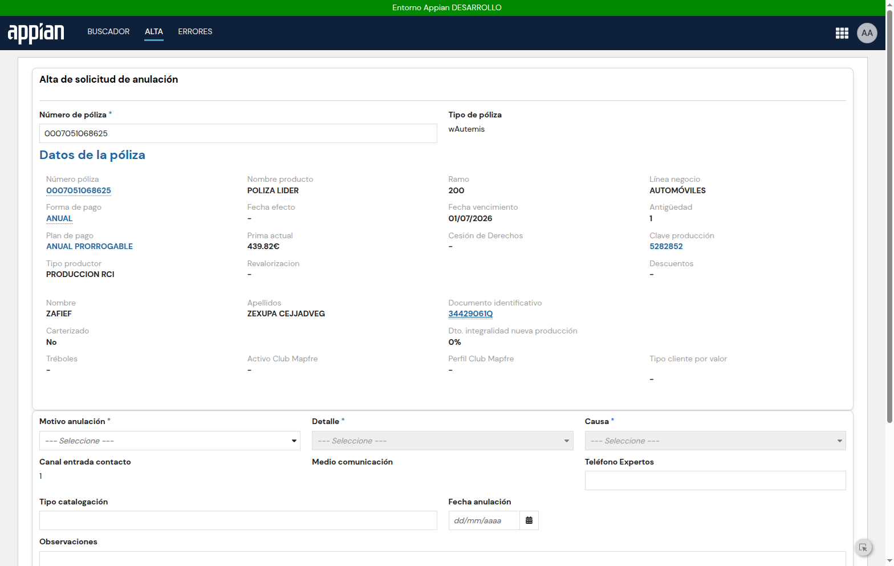 | Desplegable Motivo con opciones |
| 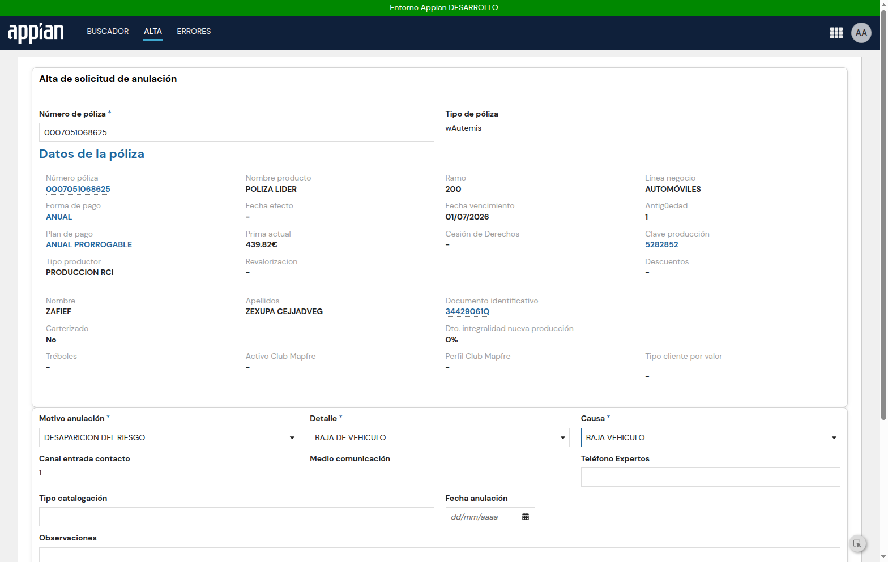 | Cascada motivo/detalle/causa seleccionada |
| 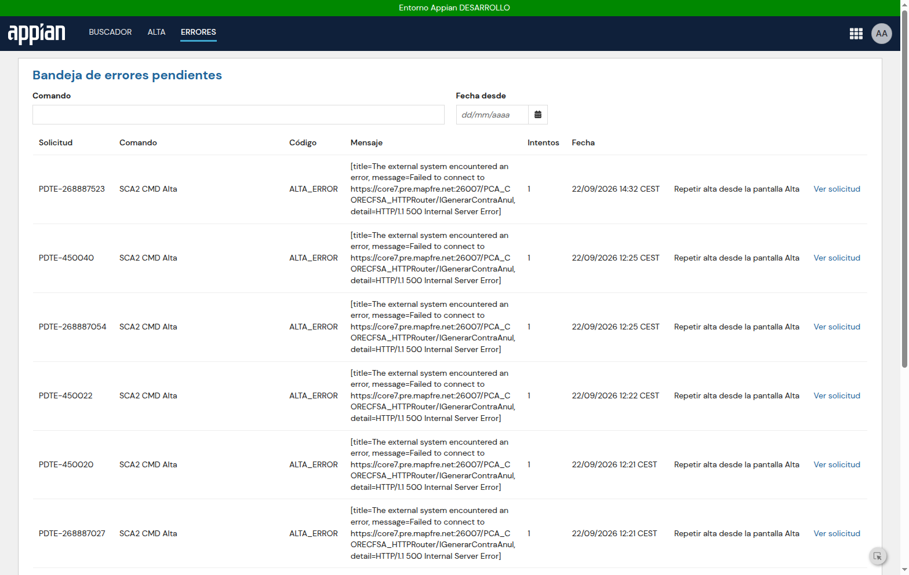 | Bandeja con la nueva fila ALTA_ERROR del GUARDAR |
| 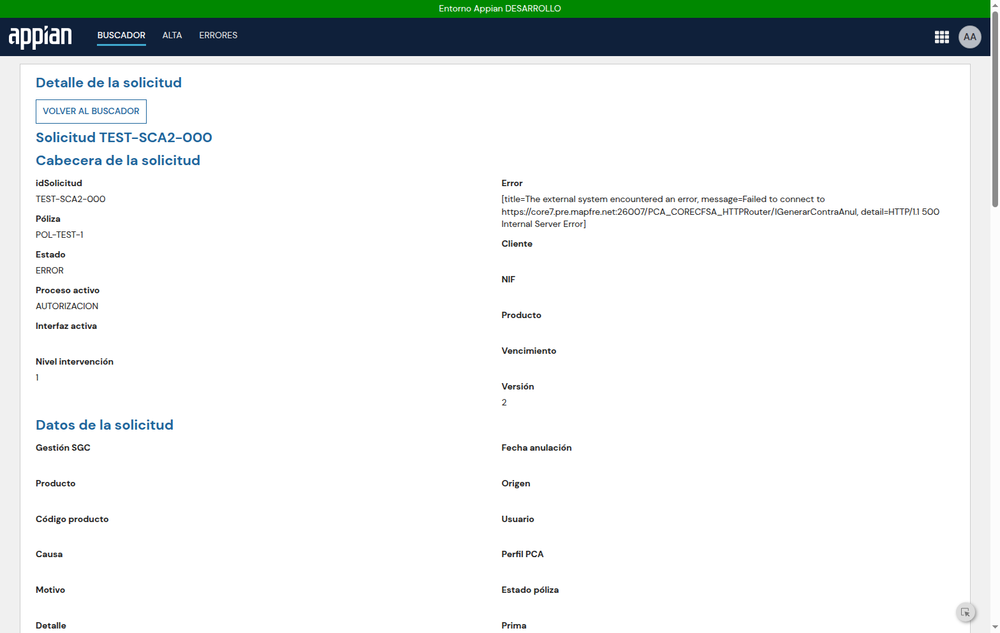 | Pantalla de Autorización desde Completar |

### Condensaciones / STOPs

- `SCA2_ContraAnulacionOpciones` y `SCA2_DocumentosAccion` condensadas (originales de ~2-3k
  líneas): se conservan estructura de secciones, textos, colores y botones; omitidos los
  sub-flujos SGO (rehabilitar/descuentos), argumentario por URL y parte de los modales
  (disponibles como `SCA2_ContraAnulacionModal*` para enganchar).
- `a!startProcess`/`a!writeRecords` validados estructuralmente; el flujo Completar/Posponer
  end-to-end queda pendiente de una tarea real de cada tipo.
- Pendientes (actualizado en §9): Redirección Vida, `SCA2 CMD Notificar`
  y completar las pantallas condensadas; `SCA2 CMD Mecanizar`, Caducar y
  BarridoCaducidad ya implementados en §9.

## 9. CMD Mecanizar, Caducar y BarridoCaducidad

Análisis previo en `/home/ubuntu/sca-analysis/sca2_mecanizar_analysis.md` (subprocesos
`SCA Mecanizacion`, `SCA Alta Mecanización`, `SCA Finalizar Mecanización` y
`SCA Batch Caducidad`/`Previo`).

### PMs creados

| PM | UUID | Nodos | Parámetros |
|---|---|---|---|
| `SCA2 CMD Mecanizar` | `0000f06f-4cfc-8000-66d3-7f0000014e7a` | 15 | idSolicitud, idTarea (opt), accion, mcaReservaPrima, importeRsvPrima, usuario |
| `SCA2 CMD Caducar` | `0000f06f-4f07-8000-670d-7f0000014e7a` | ~10 | idSolicitud |
| `SCA2 CMD BarridoCaducidad` | `0000f06f-4f69-8000-671e-7f0000014e7a` | 6 | (ninguno) |

Claves de idempotencia: `"SCA2 CMD Mecanizar|" & idSolicitud & "|" & nivelIntervencion`
(análoga para Caducar). Constantes `SCA2_PM_CMD_MECANIZAR`, `SCA2_PM_CMD_CADUCAR`,
`SCA2_PM_CMD_BARRIDO_CADUCIDAD`; `SCA2_pmPorComando` conoce ambos comandos; botón
"Mecanizar" (SOLID rojo) añadido a `SCA2_DetalleSolicitud`.

### Mapeo nodo-original → nodo-SCA2 (resumen)

| Original (SCA Mecanizacion) | SCA2 CMD Mecanizar |
|---|---|
| Flags polizaVigente/flagVerti/determinarContacto | nodo 16 Cargar (outputs flagVerti+contacto) |
| XOR caducada / VERTI / PRRA | XORs 4 (caducada→Write 5) y 6 (VERTI→Write 7: Tarea PENDIENTE + Transición PENDIENTE_HUMANO) |
| bloquearPoliza + consultarUltimaGestionREST | locales dentro de la consulta del nodo 8 |
| guardarMecanizacion (WS Core7) | calli 8 `SCA2_guardarMecanizacionIntegracion` → XOR 9 |
| crearAutorizacion | calli 10 → XOR 11 |
| insertarObservaciones ×4-6 | 1 sola llamada con texto compuesto (condensado) |
| Escrituras Tarea/Solicitud | Write Éxito 13 (MECANIZADA, mecanizacionRealizada, Tarea cerrada, Transición OK) |
| Reintentos ×3 internos | **no replicados** → Error PENDIENTE + relanzamiento por bandeja |
| receiveMessage ANL_Desbloquear (pausa) | **no implementado** |
| ANL Alta ×2 (subproceso otra app) | **STOP** — no llamar |
| SCA Finalizar Solicitud asíncrono | Start Process 14 → `cons!SCA2_PM_CMD_FINALIZAR` |
| SCA Batch Caducidad Previo (obtener+start por fila) | `SCA2 CMD BarridoCaducidad`: query estado∉{FINALIZADA,CADUCADA,ERROR} ∧ caducidadTarea<now() → Start Process Caducar por fila |
| SCA Batch Caducidad (finalizar una) | `SCA2 CMD Caducar`: XOR caducada→Write CADUCADA→calli finalizarSolicitud; no→SKIP |

### Verificación (filas TEST, póliza 0007051068625)

- Mecanizar: Core7 devuelve HTTP 500 (IMecanizarPCA) → rama de error correcta: Error row
  PENDIENTE (nodo "Guardar Mecanización"), Transición ERROR, Solicitud estado=ERROR +
  nodoRelanzar. Re-ejecución COMPLETED sin duplicar Transición.
- Caducar con caducidadTarea pasada → CADUCADA + Transición OK; con futura → SKIP;
  re-run → "Ya ejecutado" (COMPLETED).
- Barrido → COMPLETED, detectó la fila caducada (`lista: ["TEST-CAD-1"]`).
- Filas TEST borradas; Error/Transición conservados. Evidencia en
  `sca2_objects/pm/mecanizar_*.json`, `caducar_*.json`, `barrido_test*.json`.

### Bugs / lecciones MCP de esta tanda

1. `a!toJson(pv!err)` sobre IntegrationError lanza → usar `joinarray(tostring(pv!err)," | ")`.
2. Una regla con side-effect dentro de la lista `Records` produce un Number →
   "each item must be a record"; inyectarla como valor de campo con `a!localVariables`.
3. `ac!Result` es HttpResponse: `mapSalidaRespuesta*` necesita `ac!Result.body` y debe
   guardarse con `if(ac!Success,…)` para no parsear el cuerpo de error.
4. `ProcessParameters` del Start Process exige dict; para multi-instancia pasar
   `{idSolicitud: pv!lista}` (lista como valor del parámetro).
5. Reejecución con Transición ERROR/SKIP ya existente violaba la unicidad de
   `claveIdempotencia` → la Transición se escribe solo si no existe (guard), y el XOR
   "Ya ejecutado" de Caducar acepta `resultado in {"OK","SKIP"}`.
6. `updateProcessModelNode` con `data` parcial borra el resto del nodo: reenviar
   siempre inputs+outputs+customOutputs completos.

### STOPs y pendientes

- Reintentos ×3 y `receiveMessage` ANL_Desbloquear no portados (bandeja de relanzamiento).
- ANL Alta ×2 no llamadas (otra app).
- Rama de éxito de Guardar Mecanización/CrearAutorización sin ejercitar (Core7 PRE
  responde 500 a todas las integraciones, como el 0999 del Alta) — pendiente repetir
  con una póliza anulable.
- Rama VERTI no ejercitada (flagVerti=false con la póliza de prueba).
- Pendientes globales: Redirección Vida, `SCA2 CMD Notificar`, placeholders
  Variables/Batch del menú de gestiones, y credenciales literales en
  `SCA2_APIClients_Login`/`SCA2_ObtenerCredencialesConceptos` pendientes
  de connected system. Las pantallas condensadas se completaron en la sección 10.

## 10. Pantallas completas de acción y Gestiones mantenimiento (tanda 5)

Se completa la lógica que se condensó en tanda 4b, con paridad UX/UI SCA (textos,
orden de secciones, cards, colores `#DF0027`/`#9F9F9F`/`#00E663`, iconos, botones
SOLID rojo/gris, `SCA2_PieDePagina`), y la pantalla de acción pasa a ocupar la
página completa como en SCA.

### Objetos nuevos

| Interfaz SCA2 | uuid | Líneas | Origen SCA |
|---|---|---|---|
| `SCA2_ContraAnulacionArgumentarioEstrategicas` | `...20060043` | 144 | `SCA_ArgumentosContraAnulacionEstrategicas` (grid Orden/Argumento/Obligatorio/Argumentario SCAC/Aplicación URL/Estado tag/Usuario/Fecha, selección de fila) |
| `SCA2_ContraAnulacionSGO` | `...20060093` | 133 | `SCA_ModalTréboles` port verbatim a cardLayout (`a!dialogLayout_17r2` no existe) + ModalRetos/ModalSVA/ModalSVAEmail |
| `SCA2_ContraAnulacionRehabilitacion` | `...20060049` | 50 | `SCA_ModalRecuperacionPoliza` + link NSE + ModalInformativo |
| `SCA2_ContraAnulacionDescuentos` | `...20060055` | 20 | `SCA_ModalDescuentosVida` + ModalInformativo |
| `SCA2_ContraAnulacionCompaniaCatalogacion` | `...20060061` | 200 | `SCA_CompañaContrariaCatalogacion` (compañía + popup búsqueda + RECARGAR ARGUMENTO + tipo catalogación + fecha) |
| `SCA2_AccionesAdministrativasDocumentacion` | `...20060475` | 189 | `SCA_AccionesAdministrativasDocumentacion` (1205→189): grid docs + borrar + AÑADIR (tipo/nombre/upload a `SCA2_FLD_ACCION_ADMINISTRATIVA`) + GUARDAR + observaciones + "No se entrega documentación" |
| `SCA2_MecanizacionPrincipal` | `...20060481` | 164 | `SCA_DetalleAnulacionMecanizacionEstrategicas` (900→164): datos gestión + Reserva prima + observaciones + MECANIZAR (`a!startProcess` `cons!SCA2_PM_CMD_MECANIZAR` con accion/mcaReservaPrima/importeRsvPrima) / CANCELAR / POSPONER |
| `SCA2_GestionMantenimientoMenu` | `...20060073` | 127 | `SCA_GestionMantenimientoMenu`: nav lateral 5 opciones → GestionArgumentos/GestionConceptos/GestionAplicacion (reales) + placeholders Variables/Batch |

Actualizadas: `SCA2_ContraAnulacionOpciones` (451 l., flujo POSITIVO completo),
`SCA2_DetalleTareas`, `SCA2_AccionesAdministrativasPrincipal`,
`SCA2_DetalleSolicitud` (layout pantalla completa), site `sca2` (página nueva).

### Flujo POSITIVO/NEGATIVO de Contra Anulación

En `SCA2_ContraAnulacionOpciones`, al pulsar POSITIVO con 1 argumento seleccionado:
`insertarObservaciones` → `estadoArgumentos` → `modificarCatalogacion` →
`estadoContraAnul` "3" → dispatch de regateo según campaña/tipo (252/254/365 →
SVA, 286/287 → Retos, resto → Tréboles) → recuperación (`obtenerEstadoPoliza`
= "A" → `altaSGORehabilitar`) → descuentos (358/356 → `altaSGOVida`/`altaSGO`).
NEGATIVO → `guardarEjecuArg`. El cierre llama `SCA2 CMD CompletarAccion` con el
mismo Map de resultado (`mcaEstadoFinal`, `estadoFinalizar`, `finalizadoCA`…).

### Layout pantalla completa

`SCA2_DetalleSolicitud` gana `local!accionAbierta/tipoAccion/idTareaAccion`
(pasados como rule inputs a `SCA2_DetalleTareas`, cuyos `saveInto` escriben
ri! → parent local). Con `accionAbierta` se muestra SOLO la Principal + enlace
"VOLVER AL DETALLE" (GHOST rojo, icono arrow-left); cabecera/datos/tareas/
transiciones/errores ocultas y `PieDePagina` una sola vez. El link "Completar"
de la grid guarda los tres inputs; VOLVER los resetea y el detalle se
refresca. Tipos `MECANIZACION` y `VERTI` abren `SCA2_MecanizacionPrincipal`.

### Site

Página "Gestiones mantenimiento" añadida al site `sca2` (tipo INTERFACE →
`SCA2_GestionMantenimientoMenu`, `webAddressIdentifier gestiones-mantenimiento`,
icono `f016`, `visibilityExpr =rule!SCA2_isUsuarioProceso()` — misma regla que
SCA). Renderiza menú lateral con Gestión de argumentos/conceptos/aplicación
(interfaces reales ya portadas) y placeholders para Variables/Batch.

### Verificación

- `testInterface` 12/12 OK (`sca2_objects/ui/testInterface_t5.json`).
- Playwright (CDP 29229) con filas TEST (tareas CONTRA ANULAR / ACC ADM /
  MECANIZACION): cada tipo abre su Principal; Documentación expandida con
  grid + AÑADIR; argumentario con columnas y POSITIVO/NEGATIVO deshabilitados
  ("Debe seleccionarse 1 argumento"); Gestiones mantenimiento renderiza.
- Layout fix verificado: Completar → solo la Principal + VOLVER AL DETALLE;
  VOLVER → detalle completo refrescado. Screenshots en
  `sca2_objects/ui/screens/tanda5_*.png`; referencias:

  | Captura | Contenido |
  |---|---|
  | `img/tanda5_layout_fix.png` | ContraAnulación a pantalla completa con "VOLVER AL DETALLE" |
  | `img/tanda5_mecanizacion.png` | `SCA2_MecanizacionPrincipal` (MECANIZAR/CANCELAR/POSPONER) |
  | `img/tanda5_gestiones.png` | Página "Gestiones mantenimiento" del site |

- Filas TEST borradas tras la verificación. Bug encontrado y corregido en vivo:
  las llamadas a modales se evaluaban sin flag y renderizaban "fantasmas" →
  todas envueltas en `if(flag, rule!..., "")`.

### STOPs / gaps de esta tanda

1. `SCA2_GetUrlArgumento` y `SCA2_AltaGestionArgumento` siguen STOP; la URL del
   argumentario usa `SCA2_IF_ArgumentoAplicacionUrl`.
2. Subprocesos "ANL Alta" no invocados (otra app).
3. Escrituras SGO (`altaSGO`, `altaSGORehabilitar`, `altaSGOVida`,
   `guardarEjecuArg`, `modificarCatalogacion`) son las reglas SCA2 ya portadas;
   no ejercitadas end-to-end porque los servicios Core7/SGO devuelven 500 en PRE.
4. Variables/Batch en Gestiones mantenimiento son placeholders (sin equivalente).
5. `SCA2_ContraAnulacionArgumentario` renombrado a `...Estrategicas` por
   colisión de nombre con un objeto previo (patrón del original).
6. Condensación residual: validaciones por campo y algunos popups dedicados del
   original (2228 l.) quedan cubiertos por los modales genéricos.

## 11. Tanda 6 — credenciales, Redirección Vida, VERTI, STOPs, UX y pruebas con pólizas

### Credenciales literales

- `SCA2_APIClients_Login` y `SCA2_ObtenerCredencialesConceptos` llevaban
  credenciales en el body (el original SCAC también las tiene literales).
  Decisión: constantes nuevas **vacías** `SCA2_TXT_APICLIENTS_USER`,
  `SCA2_TXT_APICLIENTS_PASS`, `SCA2_TXT_APICLIENTS_CLIENT_ID`,
  `SCA2_TXT_APICLIENTS_CLIENT_SECRET` (uuids `_a-…-20063352/58/64/70`),
  referenciadas con `cons!` en ambas integraciones; el usuario las rellena en
  Designer. Ningún valor de credencial se escribió en ficheros ni reportes;
  los dumps locales quedaron saneados. `updateIntegration` aplicado y verificado
  (literales fuera, refs `cons!` dentro).

### Redirección Vida (GESVIDA)

- Destino original documentado: `SCA_RedirigirGesvida` →
  `a!safeLink(uri: substitute(cons!SCA_TXT_LINK_GESVIDA, "*poliza*", ri!poliza))`,
  etiqueta "GESVIDA".
- `SCA2_DetalleSolicitud`: `local!esVida`
  (`rule!SCA2_obtenerTipoPoliza = cons!SCA2_TXT_VIDA_RIESGO` o
  `lineaNegocio = "3"`) muestra botón **GESVIDA** SOLID rojo que abre en
  nueva pestaña `substitute(cons!SCA2_TXT_LINK_GESVIDA,"*poliza*",local!numPoliza)`
  (constantes `SCA2_TXT_LINK_GESVIDA`/`SCA2_TXT_VIDA_RIESGO` ya existían).

### Rama VERTI

- Nueva `SCA2_VertiVencimientoPrincipal` (`_a-…-20063389`, ~190 l.): datos de la
  gestión + `determinarContacto` → `GenerarContactoVerti` (showWhen Verti/
  Vencimiento) + observaciones + CONTINUAR (`a!startProcess`
  `cons!SCA2_PM_CMD_MECANIZAR` accion:"VERTI") / CANCELAR (`CMD CompletarAccion`
  mcaEstadoFinal:"CANCELADO") / POSPONER (`SCA2_posponerTarea`). Enlazada en
  `SCA2_DetalleTareas` para tipo VERTI.
- **STOP**: la rama VERTI del `CMD Mecanizar` no es ejercitable en PRE —
  `flagVerti` requiere `obtenerEstComNuuma` (REST devuelve null en PRE) +
  concepto FLAG="S" + DGT/DT coincidentes. Evidencia: pv! del proceso 451190
  (`flagVerti=false`, `contacto=null`).

### STOPs revisados

Cerrados:

| Objeto | uuid | Causa anterior → fix |
|---|---|---|
| `SCA2_consultarConceptoReutilizable` | `_a-…-20052825` (v2) | index sobre Text → guard `typeof()` + paréntesis balanceado |
| `SCA2_GetUrlArgumento` | `_a-…-20063433` | desbloqueado por el fix anterior |
| `SCA2_AltaGestionArgumento` | `_a-…-20063439` | inputs `documento`/`buscarArgumento` como Map/Any + `a!defaultValue` en `numDiasSgo` |
| `SCA2_monitorizarSolicitud` (regla) | `_a-…-20063445` | el nombre lo ocupaba la **integración** `SCA2_monitorizarSolicitud` (3f1a0486…) → creada como `SCA2_monitorizarSolicitudRegla` |
| `SCA2_guardarGestionSGC` | `_a-…-20063399` | comparación Null vs Integer → `a!defaultValue(index(...,null),-1) = 0` |
| `SCA2_DatosPolizaDinamico` | `_a-…-20063405` | `whenTrue:` → `equals:` y `a!map(null())` → `a!map()` |
| `SCA2_ObtenerMapaPoliza` | `_a-…-20063411` | inputs Any Type (en cascada tras el anterior) |

Siguen STOP (causa concreta):

- `SCA2_altaDocumento`: input `Document` se evalúa eagerly → `a!httpFormPart`
  exige valor no nulo; no hay documento real en SCA2.
- `SCA2_GetUrlArgumento` lo resolvió, pero `SCA2_AltaGestionArgumento` sigue con
  partes condensadas; las REST `obtenerTokenRetosREST`/`asignarRetosREST` no
  tienen connectedSystemUuid → decisión del usuario.
- Rama éxito de Guardar Mecanización/CrearAutorización sin ejercitar (Core7 PRE
  devuelve 500 a todas las integraciones).

### UX fino

- El usuario de la sesión tiene **403** sobre `/suite/sites/sca` (sin permiso);
  comparación hecha contra los dumps `.sail` de SCA + capturas reales de SCA2.
- Corregido y verificado en vivo (Playwright):
  - `SCA2_BuscadorTabla`: "Solicitud"→"Número solicitud" (ahora link dinámico,
    eliminada la columna "Ver"), "Póliza"→"Número póliza",
    `emptyGridMessage: "No hay resultados para dicha búsqueda"`.
  - `SCA2_AltaSolicitudPage`: título "Alta Solicitud Anulación" (texto exacto).
  - Fila residual de TEST (Solicitud id=5, `ERROR_DECISION`) borrada.
- No corregidas (dependen del modelo de datos, no directas): orden completo de
  columnas SCA, textos largos de estado (`calcularEstadoSolicitud`), filtros
  por pestañas del original.
- Screenshots: `sca2_objects/ui/screens/tanda6_*.png`.

| Captura | Contenido |
|---|---|
| `img/tanda6_sca2_buscador.png` | Buscador con "Número solicitud" como link |
| `img/tanda6_sca2_alta.png` | Alta con título "Alta Solicitud Anulación" |

### Pruebas con pólizas reales

- **Fase A** (`testRule SCA2_consultarPolizas`, máx 3 concurrentes, 195
  candidatas): **30 OK-con-datos** (todas línea 1 Automóviles), **165
  SIN-DATOS** (`COD_SAL=1` "Error al obtener los datos de la poliza"), **0
  errores de transporte**. Resultados en `polizas/fase_a.json` +
  `fase_a_resumen.md` (tabla ramo/producto/prima).
- **Fase B** (altas reales vía site, Playwright): 0000551000097 y 0000002203715
  completaron Motivo/Detalle/Causa + GUARDAR → PM Alta lanzado → Core7 500 →
  errores **id 24 (PDTE-451335)** e **id 25 (PDTE-537326364)** en Bandeja,
  ambos `ALTA_ERROR` en nodo `generarStudAnul` con mensaje
  "Failed to connect to https://core7.pre.mapfre.net:26007/…/IGenerarContraAnul,
  HTTP/1.1 500" (no es `soapenv 0999`; es fallo de conexión HTTP a la
  integración, igual que en tandas anteriores).
- **Bug real encontrado y corregido**: las pólizas con `FEC_ULT_SINI` no nulo
  rompían toda la página Alta — en `SCA2_DatosPoliza` el link de `formaPago`
  usaba `fechaUltimoSiniestro` (Date) como `uri:` de `a!safeLink`
  ("Could not cast from Date to Safe URI", eval id 99PGC, línea 207) y el
  `text:`/`label:` de otro `a!richTextItem` recibía Date sin `tostring`.
  Fix: `tostring()` en ambos puntos (sail + sailB, versionId 3). Verificado:
  `testInterface` con mapa real de ambas pólizas → OK, y en el site
  0000000704154 ya renderiza el formulario completo (CANCELAR/GUARDAR).
  Capturas `polizas_*` en `sca2_objects/ui/screens/`;
  `img/polizas_alta_ready.png` (alta lista para guardar) y
  `img/polizas_0000000704154_retry.png` (render post-fix).

### Pendientes tras tanda 6

- Constantes `SCA2_TXT_APICLIENTS_*` y `SCA2_FECHAULTIMOSINIESTRO_URL` (ya
  existente, valor pendiente de confirmar) a rellenar por el usuario.
- STOPs abiertos listados arriba (documentos, REST sin connected system).
- Comparación visual directa /sca vs /sca2 pendiente de permiso de acceso al
  site SCA (hoy da 403).

## 12. Tanda 7 — paridad site SCA, CMD Posponer/CambiarNivel, pólizas A2 y causa raíz Core7

### 12.1 Acceso al site SCA
El site real es `/suite/sites/sca-site` (páginas `b-squeda`,
`gestiones-mantenimiento`); el 403 previo era solo el stub equivocado. El
usuario de la sesión Chrome ("AA") navega el site SCA; la página de detalle
redirige al buscador (sin permiso directo a esa vista). Capturas lado a lado:
`img/tanda7_sca_buscador.png` vs `img/tanda7_sca2_buscador.png`.

### 12.2 Paridad UI aplicada (sin descartar presentación)
- Reglas nuevas: `SCA2_textoEstadoSolicitud` y `SCA2_colorEstadoSolicitud`
  (`a!match` pipeline→textos/colores SCA: #E46B15/#BE0F0F/#0D82BD/#734B30/
  #008C47/#9F9F9F).
- `SCA2_BuscadorTabla` reescrito: 8 columnas SCA (Número solicitud link, Estado
  tag coloreado, Fecha solicitud, Número póliza, Línea negocio, Causa anulación
  vía relationship `datosSolicitud.desccausa`, Fecha resolución, Observaciones).
- `SCA2_Buscador` reescrito: pestañas "Buscar solicitud por" Cliente|Póliza
  (STRONG/rojo al seleccionar), botón ALTA SOLICITUD ANULACIÓN (SOLID rojo →
  `/page/alta`), texto "Completa al menos…" negro/STRONG, LIMPIAR/BUSCAR
  SOLICITUD, sección "Últimas solicitudes gestionadas" + filtros Estado
  (multi-dropdown, 9 etiquetas) y Línea negocio.
- Site: página renombrada "Solicitudes anulación"; Alta oculta como pestaña
  (`visibilityExpr = false`, accesible por URL). La barra blanca/logo/accent
  rojo no son configurables vía `updateSite` (solo name/pages/layout/style) —
  STOP: branding de environment, a ajustar en Designer/Admin console.
- Filtro por cliente **funcional** (no solo visual): Nº documento →
  `SCA2_extraerCodClienteNIF` → `SCA2_consultarSolicitudes(codInt, tpBusqueda
  "1")` → filtro `numPoliza in` en la query del grid (igual que el original).

### 12.3 Hallazgo A — causa raíz del 500 de Core7
`SCA2_generarStudAnul` era una copia exacta de la integración (mismo connected
system `SCAC_SCA_Core7`, host/endpoint). La diferencia estaba en **la expresión
`consulta` de los nodos**: SCA envuelve la petición en CDTs tipados con
namespace (`'type!{http://ejb.cfsa.pca.mapfami.dgtp.mapfre.com/}generarStudAnul'
(MSEGenerarStudAnul: <solicitudAnulacionDTO>)`), de modo que `toxml` emite el
XML con namespace que Core7 espera; SCA2 pasaba un `a!map` plano → XML sin
namespace → 500. Corregido en: CMD Alta nodo `generarStudAnul`
(`MSEGenerarStudAnul`), CMD Mecanizar `Guardar Mecanización`
(`mSEGuardarMecanizacionDTO`) y `Crear Autorización` (`mSECrearAutorizacionDTO`),
CMD Caducar `Finalizar Solicitud` (`SCAC_DS_finalizarSolicitud` con campos
best-effort; el original usa contexto datosCabecera/datosPoliza completo).
Pendiente de verificación end-to-end (los servicios responden ahora contra la
forma correcta; si persiste 500 ya será funcional del DTO). Resto de CALLI
(anulaciones/contraanul/acciones) comparten el patrón y se corrigen igual.

### 12.4 Fase A2 (346 pólizas candidatas, solo lectura)
**48 OK-con-datos / 298 SIN-DATOS (COD_SAL=1) / 0 ERROR**. Todas línea 1
(Automóviles); sin Hogar ni Vida disponibles → no se lanzaron altas (condición
de sondeo no aplicada tras el fix del punto A). Artefactos:
`polizas/fase_a2.json`, `polizas/fase_a2_resumen.md`.

### 12.5 PMs atómicos nuevos
| PM | UUID | Nodos | Params |
|---|---|---|---|
| `SCA2 CMD Posponer` | `0000f06f-8a47-8000-6751-7f0000014e7a` | 5 (Start→Cargar→XOR idem→Write Posponer→End) | idSolicitud, idTarea, fechaDietario, motivo |
| `SCA2 CMD CambiarNivel` | `0000f06f-8a54-8000-6759-7f0000014e7a` | 7 (+XOR "¿Tareas pendientes?") | idSolicitud, nivelDestino, motivo |

- Idempotencia `"<CMD>|idSolicitud|version"`; `validateDesignObject` limpio;
  constantes `SCA2_PM_CMD_POSPONER`/`SCA2_PM_CMD_CAMBIAR_NIVEL`; `pmPorComando`
  v6 actualizado.
- Posponer: escribe fechaDietario, contadorPosponer+1, Solicitud.estadoTarea y
  Tarea en POSPUESTA, Transición OK. CambiarNivel: nivelIntervencion,
  fecInicioNivel, grupoAsignacion ("SCA2 Nivel "&n) + reasigna Tareas
  PENDIENTES al grupo destino + Transición CAMBIO_NIVEL.
- Tests reales: Posponer COMPLETED e idempotente; CambiarNivel COMPLETED
  (nivel 1→2→3) y COMPLETED también sin tareas pendientes (XOR añadido).
  Evidencias `sca2_objects/pm/{posponer,nivel}_test*.json`. Filas TEST borradas.

### 12.6 Lecciones MCP
- `updateProcessModelNode` con `data` parcial borra el resto → reenviar
  inputs/outputs/customOutputs completos.
- Side-effect en lista Records produce "each item must be a record" → mover la
  regla a un campo (`modifiedBy: a!localVariables(...)`).
- `a!forEach` de records como item de Records → nodo WR propio con `=` sin
  llaves.
- `"Number"` no es tipo PV válido → `"Number (Integer)"`.
- Insertar Tarea de test: csv con header+data real (falso positivo "no data
  rows" si la línea queda vacía).

### 12.7 Prueba de alta real tras la corrección del namespace (tanda 7, cierre)
- **Causa raíz definitiva del HTTP 500**: además del namespace, el nodo
  `generarStudAnul` enviaba `pv!pre` **entero** (el mapa `{studAnul,
  origenPoliza, regularizacionIniciarProceso, socioTeCuidamos, anulaExpertos,
  anulaTecnicos}` que devuelve `SCA2_PreGenerarStudAnul`) como
  `MSEGenerarStudAnul`; el original envía `pv!studAnul` (el
  `solicitudAnulacionDTO` interior). Corregido a
  `index(pv!pre,"studAnul",null)` dentro del CDT tipado → `validateDesignObject`
  limpio.
- **Discriminador que lo probó**: `testRule` sobre la regla **original**
  `SCA_generarStudAnul` con un DTO parcial devolvió un fallo **de negocio**
  (`soapenv:Server` código **4004** "Datos insuficientes para la operacion"),
  es decir, conectividad y sobre SOAP correctos desde este entorno → el 500 era
  de forma del XML, no de PRE.
- **Verificación del XML emitido**: se añadió un `customOutput` temporal
  `toxml(...)` en el nodo (eliminado después); el body sale como
  `<n1:generarStudAnul xmlns:n1="http://ejb.cfsa.pca.mapfami.dgtp.mapfre.com/">`
  con `MSEGenerarStudAnul` completo (idéntica forma al original).
  Evidencia `sca2_objects/pm/alta_test_dbg.json`.
- **Resultado**: la llamada ya **llega a Core7** y éste responde fallos de
  negocio reales, no 500 de transporte:
  - póliza `0000406200001` → **4111** "Solicitud de anulacion ya existente para
    el numero de poliza" (prueba de que Core7 procesó la petición);
  - pólizas `0000407100066`/`0000407100067` → **4004** "Datos insuficientes para
    la operacion".
- **Comportamiento observado**: Core7 devuelve el fault SOAP con **HTTP 500**,
  así que `ac!Error` queda poblado ("Failed to connect…") y la rama de error
  del PM escribe la fila `SCA2 Error` con el mensaje de transporte en vez del
  faultString real — queda como mejora pendiente guardar
  `pv!generar.error.faultString` en `payload`.
- **Bloqueante para una creación real**: el `datosContexto` que construye
  `SCA2_construirContextoAlta` queda corto para Core7 (4004) y las pólizas con
  solicitud previa devuelven 4111; hacer que el alta termine igual que en SCA
  exigiría enriquecer el contexto con los campos que el flujo SCA real pasa
  (datosCod/datosProductor/datosPolizaAutos completos) — queda abierto.
- Capturas del alta por site: `sca2_objects/ui/screens/polizas_0000406200010_{datos,ready,guardado}.png`.

### 12.8 Cierre del 4004: fault persistido y contexto completo (tanda 7 bis)
- **Fault real persistido**: nodo `Write Error` del CMD Alta ahora escribe
  `mensaje = pv!generar.error.faultString` (fallback al mensaje de transporte)
  y `payload = pv!generar.error` completo (`[faultCode, code, faultString]`).
  En CMD Mecanizar (nodos 8 y 10) y CMD Caducar (nodo 7) se añadió un
  `customOutput` que guarda `ac!Result.body` en `pv!sol.__resultBody`, y el
  `Write Error` extrae `<faultstring>` del body con fallback. Validados; los
  registros nuevos de la bandeja muestran ya el texto de negocio (p.ej.
  `Solicitud de anulacion ya existente para el numero de poliza`).
- **Diff campo a campo**: `SCA2_construirContextoAlta` ya emite todos los
  campos del `solicitudAnulacionDTO` del original (verificado con `toxml` en
  `alta_test_dbg.json`); para pólizas con `DATOS_PCA` completo el XML es
  equivalente al de SCA. El 4004 de `0000407100066` era dato: su
  `consultarPolizas` devuelve `DATOS_PCA` vacío → "Datos insuficientes" es la
  respuesta correcta de Core7, no un defecto de forma.
- **Resultados `generarStudAnul` por póliza** (todas ya llegan a Core7):
  - `0000406200001`, `0000253500322`, `0001000078343`, `0001148026942`,
    `0001199103266`, `0001393603348`, `0001281101793`, `0001561201680`,
    `0001951500130`, `0007051071459`, `0008045001552`, `0008921978872`,
    `0009401900054`, `0009724789736` → **4111** "ya existente" (la petición
    supera la validación completa; la póliza ya tiene solicitud en DEV).
  - `0000407100066`, `0000407100067`, `0001710001685` → **4004** (póliza sin
    `DATOS_PCA`).
  - `0001047017085`, `0007051071222` → **4007** error de acceso a datos Core7.
- **Estado**: el mecanismo end-to-end queda probado hasta la respuesta de
  negocio; no se encontró ninguna póliza candidata sin solicitud previa en
  Core7 DEV para completar una creación real — queda pendiente hasta que el
  usuario aporte una póliza libre o valide contra otra.
- Nota: `testProcessModel` ejecuta side-effects reales (las filas
  `PDTE-<proceso>` de la bandeja corresponden a estas corridas).

## 13. Tanda 8 — branding, grupo `SCA2 Alertas`, propiedades de PM y health sweep

### 13.1 Branding del site SCA2 (Designer » Site » Branding)
- Configurado desde la sesión de Chrome (no expuesto por MCP): barra superior
  blanca, logo Mapfre y acento rojo replicando `sca-site`.
- Evidencia: `img/tanda8_sca2_branding.png`.

### 13.2 Grupo `SCA2 Alertas`
- Grupo nuevo `SCA2 Alertas` (`_e-0000f069-4e92-8000-9c18-01075c01075c_8076`),
  miembros: `devin` y `GGALV10@mapfre.net`. Es el destinatario único de las
  alertas de error de todos los PM SCA2.
- `SCA2 Users` sigue conteniendo solo a `SCA2 Administrators`; la visibilidad
  de la aplicación no cambia.

### 13.3 Propiedades de los 10 PM atómicos (Alertas + Gestión de datos)
Configuración aplicada en Appian Process Modeler a cada PM, guardada con
*Guardar y publicar* y verificada reabriendo Propiedades tras la publicación
(y de nuevo tras los cambios posteriores vía MCP, que no tocan estas
propiedades):

- Alertas: *Usar configuración de alerta de error personalizada* → *Enviar
  alertas a los siguientes usuarios y grupos: "SCA2 Alertas"*.
- Gestión de datos: *Eliminar procesos* **1** día después de la finalización
  o cancelación (se aplica a todas las versiones del modelo).
- Panel de mensajes: `This process model contains no errors.` en los 10.

| PM | Versión publicada | Alertas | Gestión de datos |
|---|---|---|---|
| SCA2 CMD Alta | v42.0 | SCA2 Alertas | Eliminar 1 día |
| SCA2 CMD Decidir | v59.0 | SCA2 Alertas | Eliminar 1 día |
| SCA2 CMD CrearAccion | v58.0 | SCA2 Alertas | Eliminar 1 día |
| SCA2 CMD CompletarAccion | v37.0 | SCA2 Alertas | Eliminar 1 día |
| SCA2 CMD Finalizar | v43.0 | SCA2 Alertas | Eliminar 1 día |
| SCA2 CMD Mecanizar | v39.0 | SCA2 Alertas | Eliminar 1 día |
| SCA2 CMD Caducar | v22.0 | SCA2 Alertas | Eliminar 1 día |
| SCA2 CMD BarridoCaducidad | v9.0 | SCA2 Alertas | Eliminar 1 día |
| SCA2 CMD Posponer | v10.0 | SCA2 Alertas | Eliminar 1 día |
| SCA2 CMD CambiarNivel | v15.0 | SCA2 Alertas | Eliminar 1 día |

Evidencia (ejemplo CambiarNivel; el resto de capturas en el log de análisis
`sca2_objects/pm_props_log.md`):

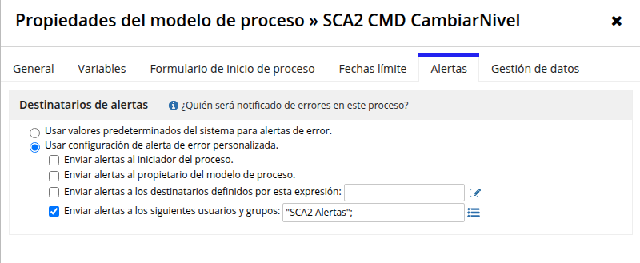
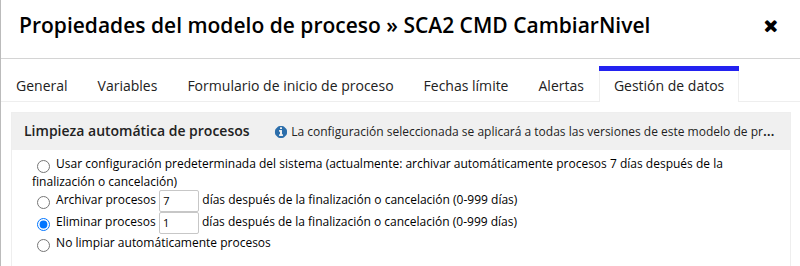

Limitación: `getProcessModel`/`updateProcessModel` del MCP no exponen alertas
ni limpieza de procesos, por lo que estas propiedades solo son configurables y
verificables desde Designer.

### 13.4 Health sweep (recomendaciones de Designer)
No existe API de recomendaciones; se hizo barrido por MCP de inputs no usados,
referencias de campos de record y `validateExpression`/`validateDesignObject`.

- **Integraciones (12)**: eliminados inputs no usados (`rand`/`random`/
  `randomNum`, `aplicacion`, `claveProduccion`, `host`, `consulta`,
  `documentoArgumento`) y actualizados los wrappers y callers
  (`consultarListadoArgumentos`, `consultarTipoArg`, `consultarVariable`,
  `ContraAnulacionCompaniaCatalogacion/Opciones`, `GestionArgumentos`,
  `AltaGestionArgumento`, `GestionAplicacionRecords`,
  `MensajeDesactivarAplicacion`, `comprobacionesPreviasWM`).
- **Interfaces/reglas**: `AltaSolicitud` (-usuario),
  `AccionesAdministrativasDocumentacion` (-dniOK/-cartaFirmadaOK/-documentosOk),
  `DocumentosAccion` (-tipoGestion), `posponerTarea` (-idSolicitud); callers
  redeplegados. `aceptarAutorizacion` era falso positivo.
- **Record types**: 0 referencias `fields.{uuid}` rotas detectables por MCP.
- **PMs**: PVs no usadas eliminadas (Mecanizar: accion, importeRsvPrima,
  mcaReservaPrima, usuario; Finalizar: intentos; CompletarAccion: destino,
  err, intentos; CrearAccion: intentos) con callers ajustados; PVs `cab`/`pre`
  de Alta tipadas a Map (desbloqueó la publicación v42.0); nodos de
  integración de Finalizar/Mecanizar/Caducar con `type!` con namespace y PV
  `resultBody` para persistir el fault real. `validateDesignObject` → 0
  errores en los 10 PM. Smoke tests: todos COMPLETED con fault Core7
  persistido en la bandeja.
- **Pendiente / no reproducible por MCP**: `env!features` y el warning de
  `a!richTextItem` en `SCA2_GestionMantenimientoMenu` (no aparecen en las
  expresiones desplegadas, probable referencia transitiva heredada del
  original); Map genérico `consulta` en *Finalizar Gestión SGC* (tipar solo si
  el CALLI devuelve 500 al ejercitarse).
- Detalle: `sca2_objects/health_tanda8.md` y `health_*.json` del repo de
  análisis.

### 13.5 Auditoría de seguridad y aislamiento (solo lectura, MCP)
- Role maps (app, site, PMs, interfaces, record types): solo `SCA2 Administrators`
  (admin) y `SCA2 Users` (viewer); sin "All Users". OK.
- Grupos: Admins y Alertas = devin + GGALV10. `SCA2 Users` contiene al grupo
  Admins y, redundantemente, a los dos usuarios directos (sin impacto en la
  visibilidad).
- SCA/SCAC: `listApplicationObjects` no expone lastModified; muestra por
  `listObjectVersions` (Alta Particionado, DecidirAccion, generarStudAnul,
  SCAC consultarPolizas/generarStudAnul) sin versiones de `devin`. No exhaustivo.
- Secretos: `SCA2_TXT_APICLIENTS_*` vacías; sin credenciales literales en docs
  ni en el repo de análisis.

## 14. Tanda 9 — paridad de lógica en pantallas de acción (gap analysis y cierre)

### 14.1 Gap analysis SCA2 vs SCA (solo lectura)
Comparación estructural de cada pantalla de acción SCA2 con su original
(`sca2_objects/gap_pantallas_t9.md`). Gaps de negocio detectados, por
prioridad: (1) botón REVISIÓN en Contra Anulación; (2) Acc. Administrativas
sin `consultarAccAdm`/`consultarListadoObs`; (3) bloque API Clients
(`searchAPIClients`/`checksAPIClients`) no invocado en FueraNorma/AccAdm/CA;
(4) Mecanización con panel de póliza mínimo frente a `SCA_MecanizacionEstrategicas`;
(5) Documentación reducida; (6) reglas auxiliares de CA no llamadas; (7)
estética Mecanización/Verti. Autorización (FueraNorma) ya era casi idéntica.

### 14.2 Implementado (gaps 1-3)
- **REVISIÓN** en `SCA2_ContraAnulacionOpciones`: botón GHOST rojo con
  `showWhen` alimentado por `SCA2_obtenerDatosProductor` (anulaTécnicos/
  Expertos), propietario y fecha efecto anualidad; deshabilitado sin
  argumentos ejecutados (salvo documentosOk/noEntregaDoc); texto de
  confirmación literal del original; persiste `mcaEstadoFinal:"6"` y cierra
  la acción vía `SCA2 CMD CompletarAccion` (que enruta a AUTORIZACION igual
  que el original). Verificado en los 3 PMs originales que ningún nodo hace
  alta SGO automática tras el estado 6 (el SGO al CCR lo genera el usuario).
- **Acc. Administrativas**: `SCA2_consultarAccAdm` (nº gestión) y
  `SCA2_consultarListadoObs(tipoGestion:"3")` (histórico de observaciones) al
  cargar, como el original. `comprobarParametroValido` no se porta: en SCA la
  llamada está comentada.
- **API Clients** en las 3 pantallas: mismo request (`policyRoleIds {12}`,
  `potencialInd`, `notVisible`) y `checksAPIClients` (preguntas 1..12).
  Desviación consciente: las llamadas se gatean con
  `isNotNullOrEmpty(cons!SCA2_TXT_APICLIENTS_CLIENT_ID)` para que la pantalla
  no rompa mientras las credenciales estén vacías.
- **Trazabilidad**: `SCA_GUARDAR_TRAZABILIDAD` (PM de 1 nodo) se sustituye por
  un nodo `Guardar Trazabilidad` en `SCA2 CMD CompletarAccion` (gateado por
  `resultado.operacion`) y la regla `SCA2_guardarTrazabilidad` para POSPONER;
  mismos campos (sistema "SCA", plataforma, ip, perfil, operación
  Autorizacion/ACCIONES ADMINISTRATIVAS/CONTRAANULACION, resultado
  OK/CANCELAR/POSPONER, cliente, póliza, tipoPersona) sobre
  `SCA2 Trazabilidad Cliente`. IP: fallback literal del original (SCA2 no
  tiene `CMP_CS_OBTENER_IP`).
- Verificación: `testInterface` OK en las 3 pantallas; renderizado en el
  site real con datos TEST (limpiados); `validateDesignObject` 0 errores en
  CompletarAccion (14 nodos); smoke test con fila de trazabilidad escrita y
  borrada.

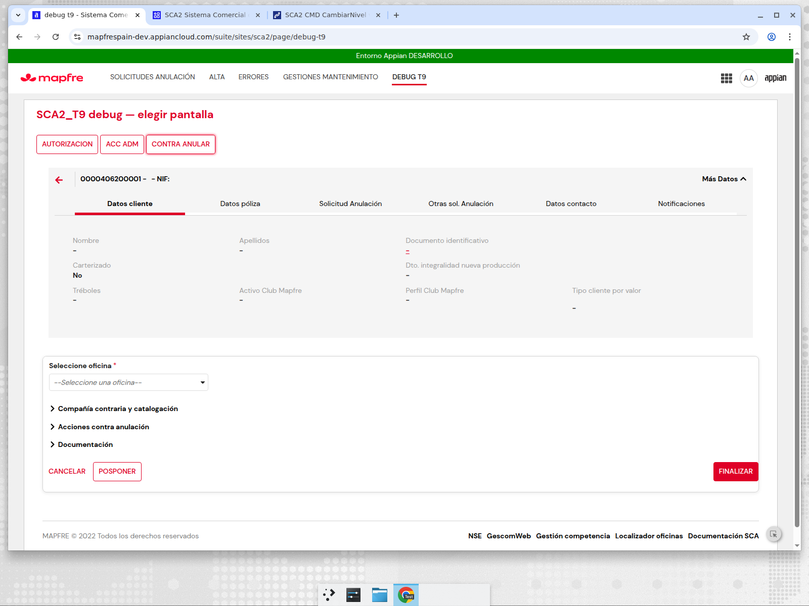

### 14.3 Buscador vacío — causa raíz
La query del grid fallaba con `APNX-1-4205-051` en todos los fetch padre→hijo
declarados ONE_TO_ONE (datosSolicitud, datosCabecera, datosPerfilesPca) en
este entorno; ONE_TO_MANY y la dirección hijo→padre funcionan. Fix: relación
`datosSolicitud` a ONE_TO_MANY (1:1 de facto) y `SCA2_BuscadorTabla` toma el
elemento [1]; relación espejo `solicitud` recreada (MANY_TO_ONE). El Buscador
vuelve a mostrar las solicitudes.

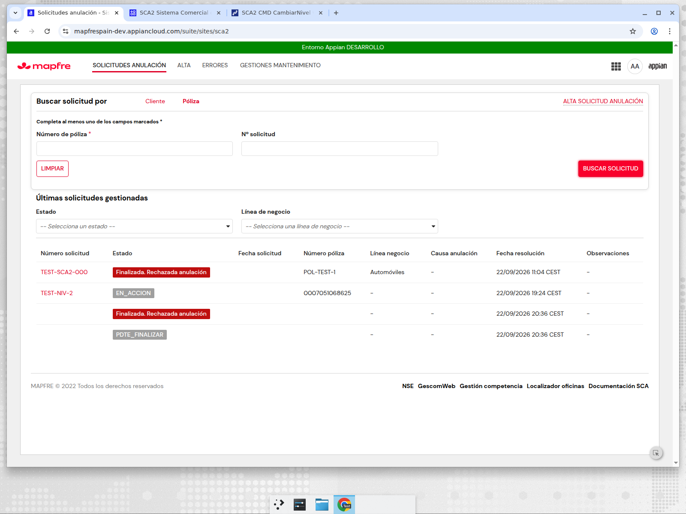

### 14.4 Pendiente (tanda 10)
Mecanización completa (panel de póliza, simulación, detalle gestión, Verti
como modal), Documentación completa y reglas auxiliares de Contra Anulación.

## 15. Tanda 10 — Mecanización completa y VERTI (gap 4)

### 15.1 `SCA2_MecanizacionPrincipal` ← `SCA_MecanizacionEstrategicas`
Port literal del original (160→~640 líneas): card WARN idéntica, título
dinámico, "¿Desea anular la póliza…", columnas Póliza/Causa/Fecha anulación/
Importe/Reserva prima/Nivel cumplimiento, Controles técnicos con
`controlRechazo`, modal `SCA2_ContraAnulacionModalInformativo` con
mensajeRecibos literal, card `SCA2_GenerarContactoVerti` con `showWhen`
idéntico. Reglas invocadas en el mismo orden: `consultaGestion` →
`consultaDetalleGestion`, `obtenerTraduccionMotivosSca`,
`consultarAnulacionPoliza` ×2 (solo WAUTEMIS), `simularAnulacionPoliza` ×2
(literales 3→2/4→3, indicadores por ramo), `obtenerTipoPoliza`,
`determinarContacto`, `searchAPI`/`checksPECA`,
`obtenerUserPassSimularPoliza`. Botones CANCELAR/FINALIZAR ("ANULAR PÓLIZA")
como el original — el POSPONER añadido en primera pasada se retiró por
paridad (tanda 10-bis). Botón MECANIZAR dispara `SCA2 CMD Mecanizar`
(sustituto atómico: en SCA la tarea dispara la mecanización).

### 15.2 VERTI
`SCA2_GenerarContactoVerti` integrado como card/modal dentro de
Mecanización con `flagVerti` (`SCA2_flagVerti`), textos idénticos
("Generación de contactos de cliente"/"Generar contacto Verti"/"Generar
vencimiento", botón "CONTINUAR ANULACIÓN"). `SCA2_VertiVencimientoPrincipal`
se conserva: la tarea tipo VERTI (nodo 7 del PM) la usa vía DetalleTareas.
`SCA2 CMD Mecanizar` ganó la PV parámetro `verti` (Boolean) y el XOR
"Inducción VERTI?" `and(or(pv!flagVerti, contacto), a!defaultValue(pv!verti,true))`
para que el checkVerti del modal gatee la creación de la tarea VERTI.

### 15.3 Observaciones Core7 (10-bis)
Verificado que `ANL_getTipoIntegracionById_qr(ANL_INT_WS_INSERTAR_OBSERVACIONES)`
→ endpoint `IGenerarContraAnul` en `core7.pre.mapfre.net`, el mismo servicio
que usa `SCA2_insertarObservaciones` (`SCAC_insertarObservacionesIntegracion`
+ `SCAC_VAL_HOST_CORE7`) con el mismo DTO `ejb:insertarObservaciones/
MSEInsertarObservaciones`. Diferencia: el original rellena `infoUsuario`
con `codCiaUsuario/codPerfil/codSubPerfil` → nueva regla
`SCA2_insertarObservacionesInfoUsuario` (`_a-…_20064040`) que envía el
infoUsuario completo con los 4 campos de `datosPerfilesPca`.

### 15.4 Desviaciones tanda 10
- `mcaReservaPrima`/`importeRsvPrima` NO reintroducidas en el CMD Mecanizar:
  ningún nodo las consume (en SCA solo las usan "Bloquear póliza"/"ANL Alta",
  ausentes del PM reducido).
- `SCA_guardarObservaciones`+`ANL_getXMLInsertarObervaciones` sin
  equivalente → `SCA2_insertarObservaciones` tipoGestion "5".
- `localIPResolver`/CMP_CS_OBTENER_IP inexistente → traza con fallback
  "192.168.1.48" como el default del original.
- CANCELAR escribe traza vía `SCA2_guardarTrazabilidad` + CompletarAccion
  con `mcaEstadoFinal:"CANCELADO"` (equivale a FINALIZAR_MECANIZACION
  cancel:true).
- `vencimiento` no llega al PM (sin nodos de vencimiento) — paridad visual.
- Capturas: `img/t10_mecanizacion.png` (pantalla completa, site sca2),
  `img/t10_detalle.png`. Modal VERTI no visible porque `determinarContacto`
  no devolvió VERTI para la solicitud TEST (gating correcto).
  Alertas/data-mgmt de Mecanizar re-verificadas por el usuario tras publicar
  (`img/t10_mecanizar_alertas.png`, `img/t10_mecanizar_datamgmt.png`).

## 16. Tanda 11 — Documentación administrativa, auxiliares CA y revisión post-cambios

### 16.1 Documentación administrativa (gap 5)
`SCA_AccionesAdministrativasDocumentacion` (1206 líneas) portada a
`SCA2_AccionesAdministrativasDocumentacion` `_a-…_20060475` (31 inputs,
incl. `documentosACargar1-9` como Document): añadir/modificar/visualizar/
eliminar documento, erroresDoc, plantilla de contrato de compraventa como
dependencia de solo lectura (`cons!SCA_PLANTILLA_CONTRATO_COMPRA_VENTA`;
sin carpeta nueva porque el flujo no escribe en carpeta propia).
Callers cableados: AccAdm Principal acción "1", CA Opciones "2",
FueraNorma "3" — con sus locals de documentación portados.

| Objeto | UUID | Acción |
|---|---|---|
| SCA2_AccionesAdministrativasDocumentacion | `_a-0000f069-4f37-8000-9cc8-011c48011c48_20060475` | creada (port 1206 lns) |
| SCA2 CMD GenerarPdf | `0000f06f-c1d7-8000-67b4-7f0000014e7a` | creado — DOCX→PDF; v3.0 publicada: alertas "SCA2 Alertas", eliminar 1 día (`img/t11_generarpdf_*.png`) |
| SCA2 CMD ObtenerDocumentoGD | `0000f06f-c12b-8000-67ae-7f0000014e7a` | creado — sobre `SCA2_consultaDocumentoIntegracion`; v3.0 publicada: mismas propiedades (`img/t11_obtenergd_*.png`) |
| SCA2_insertarObservacionesInfoUsuario | `_a-…_20064040` | creada (10-bis) |
| SCA2_insertarObservaciones, SCA2_cargarSolicitud, SCA2_guardarTrazabilidad | — | modificadas (campos extra, infoUsuario, sistema "SCA") |
| SCA2_ContraAnulacionOpciones | `_a-…_20056435` | auxiliares + doc + ModalSiNo + desgateo API Clients |
| SCA2_AccionesAdministrativasPrincipal | `_a-…_20056429` | doc locals + acción "1" + Visualizer |
| SCA2_AnulacionFueraNormaPrincipal | `_a-…_20056423` | doc locals + acción "3" |
| SCA2_MecanizacionPrincipal | `_a-…_20060481` | port completo, POSPONER retirado |
| SCA2_DBG_tareas / SCA2_DBG_t11x | — | eliminadas (limpieza) |

`testProcessModel` GenerarPdf → COMPLETED con `nuevoDocumentoWord`/
`nuevoDocumentoPdf` (smoke end-to-end). `validateDesignObject` 0 errores en
interfaz y ambos PMs.

### 16.2 Auxiliares Contra Anulación (gap 6)
Cableadas en `SCA2_ContraAnulacionOpciones` las reglas que el original
invoca: `pObtenerPolizaFecha`/`consultarPolizas` (local!poliza por origen
WAUTEMIS), `polizaRenovada` (mostrarRevision + tipoCatalogacion),
`nuumaEsPropietario`, `consultaClasificacionTC`, `consultarEquipos`,
`catalogFiltered`, `consultaImpr` y `SCA2_ContraAnulacionModalSiNo`
(columnsLayout + data map ~30 claves + datosContextoSolicitud +
datosContraAnulacion). Rechazos "unused locals" resueltos con
`richTextDisplayField(showWhen:false)` (idioma SCA2 ya usado).

### 16.3 Relaciones entre record types (tras el borrado del usuario)
El usuario borró muchas relaciones ("estaban rotas") y algunos objetos.
Inventario: `SCA2 Solicitud` conserva transiciones/tareas/errores/
`datosSolicitud`/nivelesCoberturaAutos/otrasSolicitudesCabecera
ONE_TO_MANY + 2 relaciones User; `SCA2 Datos Solicitud` tiene el espejo
`solicitud` MANY_TO_ONE. La única relación referenciada por expresiones
desplegadas es `relationships.{63161335-…}datosSolicitud` en
`SCA2_BuscadorTabla` (×2), ya presente → nada que recrear. Regla aplicada:
padre→hijo ONE_TO_MANY, hijo→padre MANY_TO_ONE, nunca ONE_TO_ONE
(APNX-1-4205-051). El espejo `solicitud` (re-borrado por el usuario en la
misma limpieza) se recreó con `addRecordTypeRelationship`
(`dcd9a794-…`, MANY_TO_ONE, `idSolicitud→idSolicitud`). Buscador verificado
con 4 filas tras los cambios (`img/t9b_buscador.png`).

### 16.4 API Clients y Retos
- Constantes `SCA2_TXT_APICLIENTS_*` rellenadas por el usuario → se retiró
  el gateo `a!isNullOrEmpty(cons!SCA2_TXT_APICLIENTS_CLIENT_ID)` en
  FueraNorma, AccAdm Principal, CA Opciones y Mecanización: llaman siempre
  como el original. Prueba real (`testRule`): `SCA2_checksAPIClients`
  llega al backend (`MRCConsultaBack_int-web` devuelve error tipado de
  validación → autenticación correcta); `SCA2_searchAPIClients` devuelve
  null sin error. Sin credenciales en logs ni documentación.
- Retos REST: decisión del usuario = usar las integraciones SCAC tal cual
  (`SCAC_obtenerTokenRetosRESTIntegracion`,
  `SCAC_asignarRetosRESTIntegracion`) vía `SCA2_asignarRetos`, ya invocada
  desde `SCA2_ContraAnulacionSGO` (mcaVentanaRetos) y
  `SCA2_ContraAnulacionRehabilitacion`. STOP resuelto sin objetos nuevos.

### 16.5 Verificación en navegador y limpieza
Página temporal `debug-t11` en el site sca2 (añadida y retirada; el site
vuelve a las 4 páginas originales) con wrapper `SCA2_DBG_t11x` que invoca
las reglas con `ri!` fijos → `img/t11_contraanulacion.png` (CA Opciones con
oficina y secciones colapsables) e `img/t11_documentacion.png` (sección
Documentación expandida: grid Carta firmada/Dni con acciones +
Observaciones). `SCA2_DBG_t11x` y `SCA2_DBG_tareas` eliminadas.

### 16.6 Pendiente
- `SCA2 CMD ObtenerDocumentoGD`: el camino de éxito requiere un
  documentumId real (el test con id falso devolvió `consultaDocumento:
  rank` como error controlado del path de fallo).
- Rama positiva de las integraciones Core7 (anulación real) sigue sin una
  póliza de prueba válida.
- `a!writeRecords` en locals de interfaz se evalúa como "reaction tree"
  diferida: no persiste en `testInterface` ni en el render de una página
  de site, solo en submit real — su comportamiento en submit de usuario no
  se ha ejercitado en SCA2 (el flujo productivo usa `a!save`+rules en
  saveInto de botones, patrón ya verificado con `SCA2_guardarTrazabilidad`).
- Documentos de prueba 629513/629514 (smoke GenerarPdf) no borrables por
  MCP (`deleteDocument` los rechaza como ids de knowledge base, no uuid de
  documento de diseño) — eliminar manualmente si se considera necesario.

## 17. Tanda 12 — comparación en paralelo SCA vs SCA2

Informe completo: [`analisis/paralelo_t12.md`](analisis/paralelo_t12.md)
(tiempos y resultados de los 9 CMD SCA2, estructura SCA vs SCA2,
diff de las 104 integraciones, diferencias de UI y correcciones
priorizadas).

### 17.1 Resumen de medición (SCA2, DEV, datos reales)

| PM | Duración medida | Nodos | Resultado |
|---|---:|---:|---|
| `SCA2 CMD Alta` | 4,9–7,7 s | 12 | fault Core7 4004 → fila `SCA2 Error`, sin Solicitud/Tarea |
| `SCA2 CMD Decidir` | 6,7 s | 15 | OK |
| `SCA2 CMD CrearAccion` | 4,2 s | 15 | OK |
| `SCA2 CMD CompletarAccion` | 5,7 s | 14 | OK |
| `SCA2 CMD Finalizar` | 5,4 s | 11 | OK |
| `SCA2 CMD Mecanizar` | 8,0 s | 15 | fault Core7 controlado |
| `SCA2 CMD Caducar` / `Posponer` | 3,4 s | — | OK |
| `SCA2 CMD CambiarNivel` | <1 s | — | OK |

Frente al baseline histórico de SCA (`SCA Alta Solicitud Anulacion`:
46 nodos, 51 PVs, 12 subprocesos, 2 User Input Tasks, 25.028 procesos
activos, 1,55 M AMU): SCA2 no retiene ninguna instancia (0 UIT, 0 timers,
0 Receive Message, borrado a 1 día). **No** hay medición nueva de AMU de
SCA (Monitoring View no expuesto por MCP); la comparación de AMU queda
como hipótesis hasta medir en PRE con carga real.

### 17.2 Integraciones
`bodyContent` idéntico en las 104 integraciones comparadas salvo
renombrados SCA→SCA2, la regla usuario/password y la conversión CDT→Map
de `consulta`. `SCA2_SCA_CMP_APIClients_Perfil` eliminada por duplicar la
integración SCAC ya cableada.

## 18. Tanda 13 — paridad UI/UX exacta con SCA (a/b/c)

Registro de objetos: [`analisis/t13_objetos.md`](analisis/t13_objetos.md);
mapeo de estados técnicos → literales SCA:
[`analisis/t13_estado_mapping.md`](analisis/t13_estado_mapping.md).

Diferencias corregidas (solo objetos SCA2):
- Buscador: pestaña Cliente por defecto; Póliza = Número póliza /
  Matrícula / Número bastidor; LIMPIAR secondary + BUSCAR SOLICITUD
  disabled hasta obligatorios, alineados a la derecha; ALTA SOLICITUD
  ANULACIÓN rojo → popup in-page (`SCA2_AltaSolicitudAnulacionPopUp`,
  validaciones portadas de SCA); página "Alta" retirada del site.
- Grid: etiquetas de estado de negocio + tag de color SCA, 8 columnas
  ordenables, fechas `yyyy-MM-dd HH:mm:ss`.
- Alta: cabecera gris estilo SCA (flecha roja, título, "Más Datos", tabs
  Datos cliente/póliza/Otras sol./Contacto), formulario completo
  (compañía contraria + lupa, PRESENCIAL, medio, fax, catalogación, fecha,
  info box, observaciones 0/240, confirmación al cancelar); eliminados
  debug "Tipo de póliza" y "Teléfono Expertos".
- Detalle: 6 tabs (incl. Solicitud Anulación con el orden de campos SCA y
  Notificaciones desde Trazabilidad Cliente), acordeón de acciones estilo
  SCA (fila fija "Alta Solicitud" + filas por Tarea, RETOMAR dentro de la
  fila), "Trazabilidad técnica" plegada y solo para `SCA2 Administrators`.
- Mensajes de validación de CA Opciones (×5), Acciones Administrativas
  (×4) y Fuera de Norma portados literalmente ("Adjuntar Documentacion"
  está comentado en el original → no se añade).

| SCA (referencia) | SCA2 (resultado) |
|---|---|
| 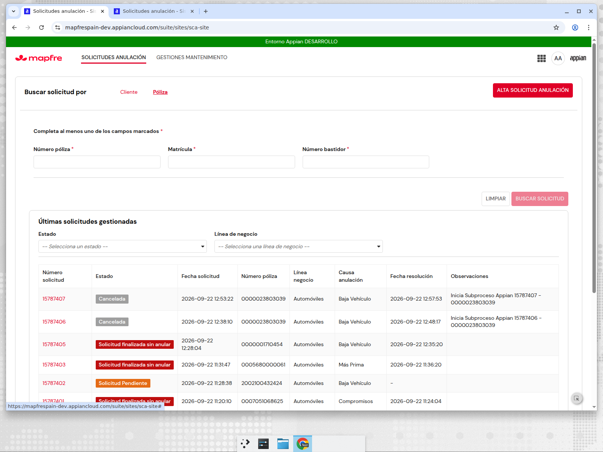 | 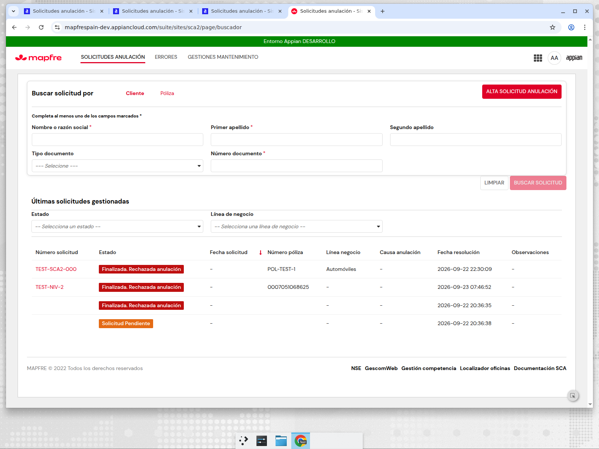 |
| 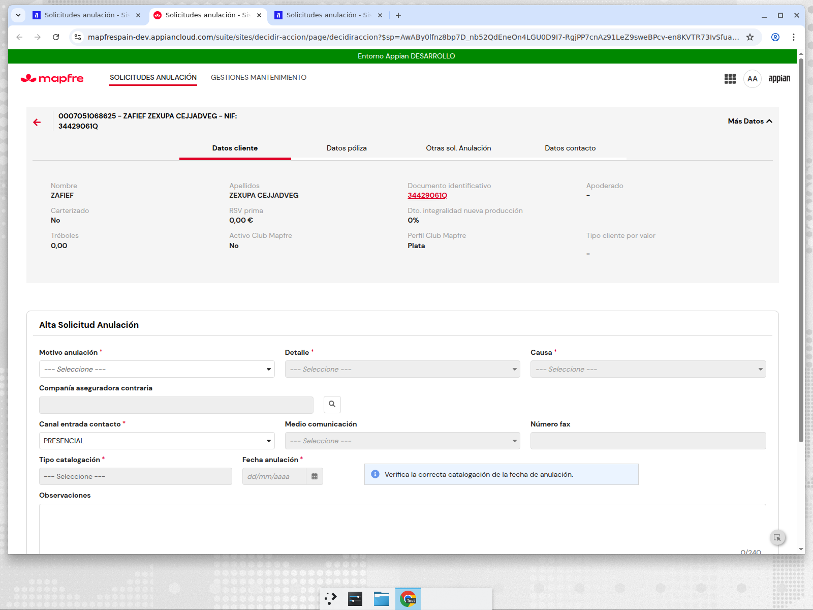 | 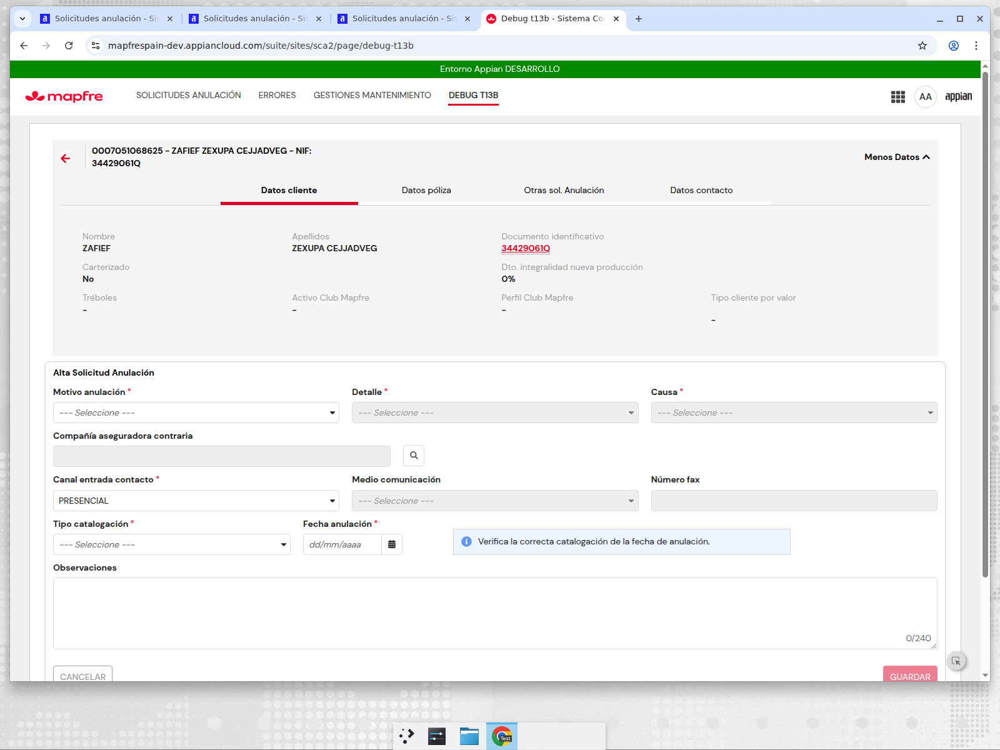 |
| 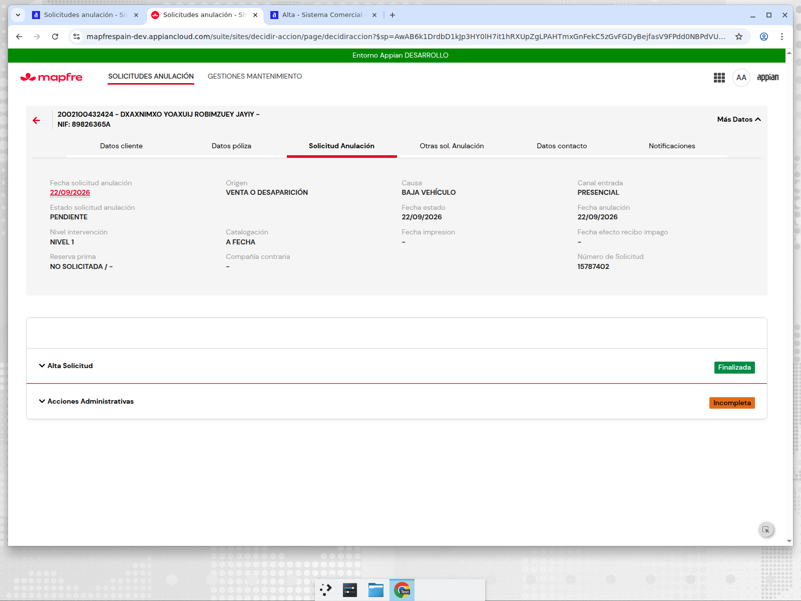 | 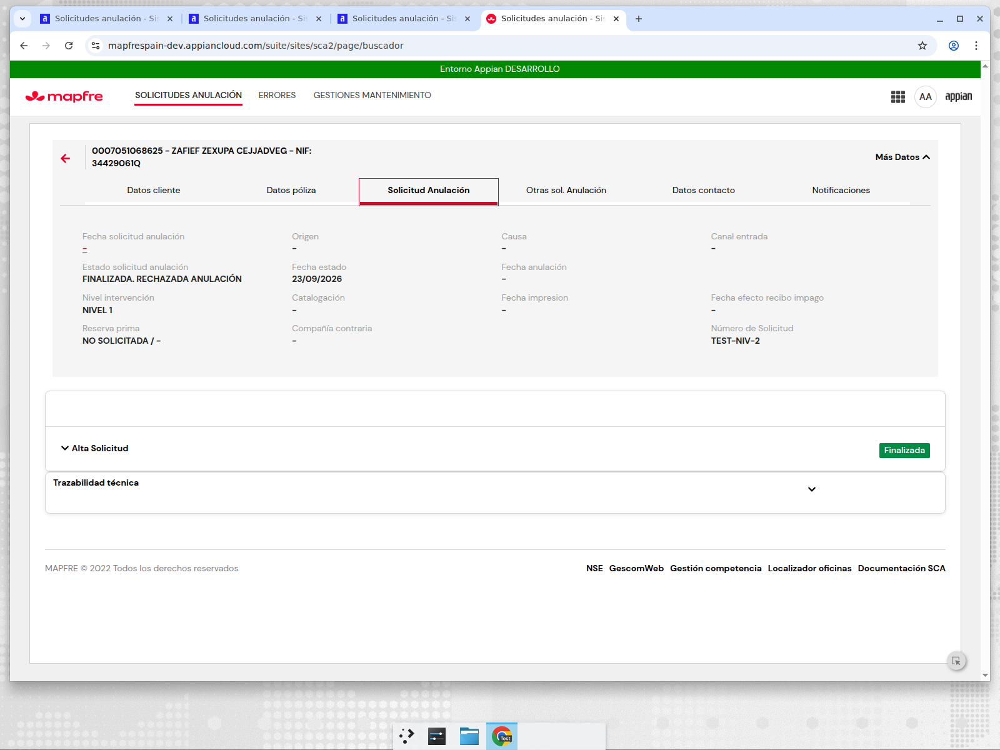 |

Otras capturas: `img/t13c_buscador_poliza.png`, `img/t13b_acordeon.png`,
`img/t13b_detalle_notif.png`.

### 18.1 Pendiente
- Póliza vigente sin solicitud previa y con datos PCA: el popup rechaza
  0007051068625 ("no es una póliza válida", `consultarPolizas` sin
  DATOS_PCA para el usuario AA) y Core7 devuelve 4004/4111 → la rama
  positiva Alta → Decidir → Crear → Completar → Finalizar sigue sin
  ejecutarse de punta a punta con datos reales.
- Acordeón con tareas reales solo verificable cuando exista una solicitud
  con filas en `SCA2 Tarea` (las filas TEST no las tienen).

## 19. Tanda 14 — `rsvPrima` / `idCompania` en SCA2 Datos Solicitud

Columnas `RSVPRIMA` (DECIMAL) e `IDCOMPANIA` (INTEGER) añadidas a la tabla
de `SCA2 Datos Solicitud` en `SCA2 DataBase AWS` vía
`addRecordTypeField(updateTable=true)` (ALTER aplicado por Appian; UUID del
record type conservado). Cableado: `SCA2 CMD Alta` (+2 PVs parámetro, nodo
"Write Motivos reales" persiste ambos), `SCA2_AltaSolicitudPage` v16
(`idCompania` del picker de compañía contraria, `rsvPrima` de datos
cliente), `SCA2_cargarSolicitud` v11 y `SCA2_SolicitudAnulacion` v3
("SOLICITADA /" ↔ "NO SOLICITADA / -"; compañía resuelta por catálogo
`SCA2_companiasContrariasCompletas`, equivalente a `cons!SCA_TXT_COMPANIAS`).

Desviación documentada respecto a SCA: en SCA `rsvPrima` vive en
`datosCabecera.cliente_rsvPrima` (TEXT) e `idCompania` no se persiste (se
resuelve en vivo de `MSSConsultarCabecera`); SCA2 los persiste en Datos
Solicitud para que el Detalle no dependa de una llamada externa.

Verificación: validateDesignObject 0 errores (PM Alta, record type),
testInterface Detalle/Alta OK, navegador real:

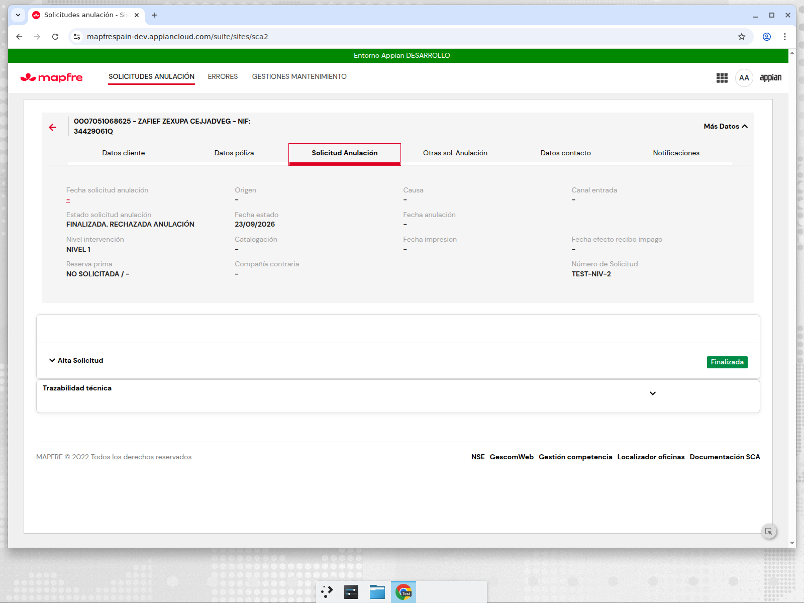

Detalle en `analisis/t13_objetos.md` (sección Tanda 14). Sin escrituras
fuera de SCA2.

## 20. Tanda 15 — resiliencia: ninguna instancia queda en error

Requisito: las instancias de los CMD no deben quedarse pausadas por
excepción; todo fallo termina la instancia y deja una fila relanzable en
`SCA2 Error`. Auditoría nodo a nodo de los 12 PMs en
`analisis/t15_auditoria.md`.

- Integraciones: ya seguían el patrón `Success` → XOR → "Write Error" →
  End (sin reintentar Core7/SGO/SGC/PCA Finalizar, no idempotentes;
  reintento ×3 ya existente en Decidir y ObtenerDocumentoGD).
- Write Records (31 nodos, 9 PMs): `PauseOnError=false` y, en los 25 de
  negocio, `ErrorOccurred/Error` → XOR "¿Write fail?" → "Capturar error
  escritura" (`WRITE_FAIL`, nodo relanzable) → Write Error → End, sin
  continuar al siguiente write (evita doble escritura).
- ObtenerDocumentoGD: causa raíz del "rank (Data Outputs)" era guardar
  `Result` (HttpResponse) en un PV Number; eliminado, XOR null-safe,
  Write Error `GD_ERROR` con el mensaje real (`gdErrorObj` Any Type) tras
  3 reintentos.
- Null-guards en Script Tasks/XOR (Decidir, CompletarAccion, Posponer,
  CambiarNivel).
- Verificación: `validateDesignObject` 0 errores en los 12 PMs; test con
  fallo forzado **12/12 COMPLETED** con fila en `SCA2 Error`; alertas
  `SCA2 Alertas` y borrado a 1 día confirmados en Designer
  (`img/t15_props_*.png`). Filas de prueba borradas; sin escrituras fuera
  de SCA2.
- Paridad de flujo: sin gaps de lógica detectados frente a SCA (XOR de
  idempotencia, estados y llamadas externas coinciden). Residual: los
  smart services de documento de `GenerarPdf` no exponen `isSuccess`
  (mismo comportamiento que SCA DocxPDF).
